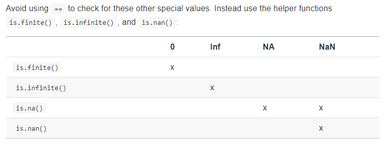
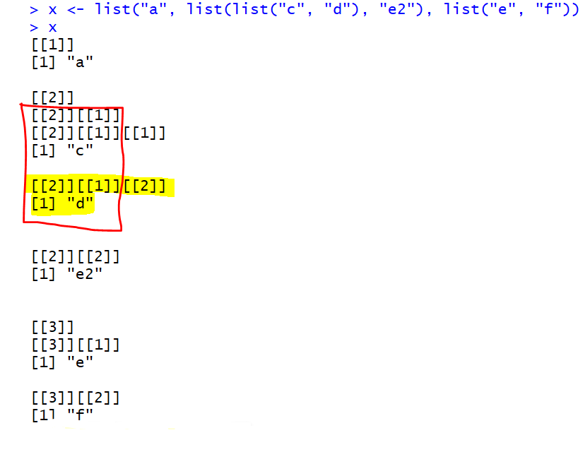

Vectors
================
Bryan Shalloway
Last updated: 2019-02-13

  - [ch. 20: Vectors](#ch.-20-vectors)
      - [20.3.5](#section)
      - [20.4: Using atomic vectors](#using-atomic-vectors)
          - [20.4.6](#section-1)
      - [20.5: Recursive vectors (lists)](#recursive-vectors-lists)
          - [20.5.4](#section-2)
      - [20.7: Augmented vectors](#augmented-vectors)
          - [20.7.4](#section-3)
  - [Appendix](#appendix)
      - [subsetting nested lists](#subsetting-nested-lists)

*Make sure the following packages are installed:*

``` r
knitr::opts_chunk$set(echo = TRUE, cache = TRUE, message = FALSE)

library(tidyverse)
library(ggplot2)
library(dplyr)
library(tidyr)
library(nycflights13)
library(babynames)
library(nasaweather)
library(lubridate)
library(purrr)
library(readr)
```

# ch. 20: Vectors




  - `typeof` retruns type of vector
  - `length` returns length of vector
  - `pryr::object_size` view size of object stored
  - specific `NA` values can be defined explicitly with `NA_integer_`,
    `NA_real_`, `NA_character_` (usually don’t need to know)
  - explicitly differentiate integers from doubles with 10L v 10
  - explicit coersion functions: `as.logical`, `as.integer`,
    `as.double`, `as.character`, or use `col_[types]` when reading in so
    that coersion done at source
  - test functions from `purrr` package that are more consistent than
    base R’s


  - `set_names` lets you set names after the fact, e.g. `set_names(1:3,
    c("a", "b", "c"))`
  - For more details on subsetting:
    <http://adv-r.had.co.nz/Subsetting.html#applications>
  - `str` checks structure (excellent for use with lists)
  - `attr` and `attributes` get and set attributes
      - main types of attributes: **Names**, **Dimensions/dims**,
        **Class**. Class is important for object oriented programming
        which is covered in more detail here:
        <http://adv-r.had.co.nz/OO-essentials.html#s3>
  - `useMethod` in function syntax indicates it is a generic function
  - `methods` lists all methods within a generic
  - `getS3method` to show specific implementation of a method
  - Above are used together to investigate details of code for functions

<!-- end list -->

``` r
as.Date
```

    ## function (x, ...) 
    ## UseMethod("as.Date")
    ## <bytecode: 0x000000001d3cd438>
    ## <environment: namespace:base>

``` r
methods("as.Date")
```

    ## [1] as.Date.character as.Date.default   as.Date.factor    as.Date.numeric  
    ## [5] as.Date.POSIXct   as.Date.POSIXlt  
    ## see '?methods' for accessing help and source code

``` r
getS3method("as.Date", "default")
```

    ## function (x, ...) 
    ## {
    ##     if (inherits(x, "Date")) 
    ##         x
    ##     else if (is.logical(x) && all(is.na(x))) 
    ##         .Date(as.numeric(x))
    ##     else stop(gettextf("do not know how to convert '%s' to class %s", 
    ##         deparse(substitute(x)), dQuote("Date")), domain = NA)
    ## }
    ## <bytecode: 0x000000001d50cbf0>
    ## <environment: namespace:base>

  - Unfortunately, tidyverse functions are not particularly easy to
    unpack/understand this way…

<!-- end list -->

``` r
select
```

    ## function (.data, ...) 
    ## {
    ##     UseMethod("select")
    ## }
    ## <bytecode: 0x000000001960bcf0>
    ## <environment: namespace:dplyr>

``` r
methods("select")
```

    ## [1] select.data.frame* select.default*    select.grouped_df*
    ## [4] select.list        select.tbl_cube*  
    ## see '?methods' for accessing help and source code

``` r
getS3method("select", "default")
```

    ## function (.data, ...) 
    ## {
    ##     select_(.data, .dots = compat_as_lazy_dots(...))
    ## }
    ## <bytecode: 0x000000001bb57dd8>
    ## <environment: namespace:dplyr>

  - **Augmented vectors**: vectors with additional attributes,
    e.g. factors (levels, class = factors), dates and datetimes (tzone,
    class = (POSIXct, POSIXt)), POSIXlt (names, class = (POSIXLt,
    POSIXt)), tibbles (names, class = (tbl\_df, tbl, data.frame),
    row.names) – in the integer, double and double, list, list types.
      - data.frames only have class data.frame, whereas tibbles have
        tbl\_df, and tbl as well

<!-- end list -->

``` r
a <- list(a = 1:3, b = "a string", c = pi, d = list(c(-1,-2), -5))

a[[4]][[1]]
```

    ## [1] -1 -2

  - `class` get or set class attribute
  - `unclass` returns copy with ‘class’ attribute removed \#\# 20.3:
    Important types of atomic vector

### 20.3.5

1.  Describe the difference between `is.finite(x)` and
    `!is.infinite(x)`.
    
      - both `is.infinite` and `!is.infinite` return `FALSE` for `NA` or
        `NaN` values, therefore these values will become `TRUE` when
        negated, e.g. see example below:
    
    <!-- end list -->
    
    ``` r
    is.finite(c(6,11,-Inf, NA, NaN))
    ```
    
        ## [1]  TRUE  TRUE FALSE FALSE FALSE
    
    ``` r
    !is.infinite(c(6,11,-Inf, NA, NaN))
    ```
    
        ## [1]  TRUE  TRUE FALSE  TRUE  TRUE

2.  Read the source code for `dplyr::near()` (Hint: to see the source
    code, drop the `()`). How does it work?

3.  A logical vector can take 3 possible values. How many possible
    values can an integer vector take? How many possible values can a
    double take? Use google to do some research.
    
      - it checks if the difference between the value is within `tol`
        which by default is `.Machine$double.eps^0.5`

4.  Brainstorm at least four functions that allow you to convert a
    double to an integer. How do they differ? Be precise.
    
      - `as.integer`, `as.factor` (technically is going to a factor),
        `round(, 0)`, `floor`, `ceiling`, these last 3 though do not
        change the type, which would remain an integer

5.  What functions from the readr package allow you to turn a string
    into logical, integer, and double vector?
    
      - `parse_*` or `col_*`

## 20.4: Using atomic vectors

### 20.4.6

1.  What does `mean(is.na(x))` tell you about a vector `x`? What about
    `sum(!is.finite(x))`?
    
      - percentage that are `NA` or `NaN`
      - number that are either `Inf`, `-Inf`, `NA` or `NaN`

2.  Carefully read the documentation of `is.vector()`. What does it
    actually test for? Why does `is.atomic()` not agree with the
    definition of atomic vectors above?
    
      - `is.vector` tests if it is a specific type of vector with no
        attributes other than names. This second requirement means that
        any augmented vectors such as factors, dates, tibbles all would
        return false.
      - `is.atomic` returns TRUE to `is.atomic(NULL)` despite this
        representing the empty set.

3.  Compare and contrast `setNames()` with `purrr::set_names()`.
    
      - both assign names after fact
      - `purrr::set_names` is stricter and returns an error in
        situations like the following where as `setNames` does not
    
    <!-- end list -->
    
    ``` r
    setNames(1:4, c("a"))
    ```
    
        ##    a <NA> <NA> <NA> 
        ##    1    2    3    4
    
    ``` r
    set_names(1:4, c("a")) 
    ```
    
        ## Error: `nm` must be `NULL` or a character vector the same length as `x`

4.  Create functions that take a vector as input and returns:
    
    ``` r
    x <- c(-3:14, NA, Inf, NaN)
    ```
    
    1.  The last value. Should you use `[` or `[[`?
    
    <!-- end list -->
    
    ``` r
    return_last <- function(x) x[[length(x)]]
    
    return_last(x)
    ```
    
        ## [1] NaN
    
    1.  The elements at even numbered positions.
    
    <!-- end list -->
    
    ``` r
    return_even <- function(x) x[((1:length(x)) %% 2 == 0)]
    
    return_even(x)
    ```
    
        ##  [1]  -2   0   2   4   6   8  10  12  14 Inf
    
    1.  Every element except the last value.
    
    <!-- end list -->
    
    ``` r
    return_not_last <- function(x) x[-length(x)]
    
    return_not_last(x)
    ```
    
        ##  [1]  -3  -2  -1   0   1   2   3   4   5   6   7   8   9  10  11  12  13
        ## [18]  14  NA Inf
    
    1.  Only even numbers (and no missing values).
    
    <!-- end list -->
    
    ``` r
    #only even and not na
    return_even_no_na <- function(x) x[((1:length(x)) %% 2 == 0) & !is.na(x)]
    
    return_even_no_na(x)
    ```
    
        ##  [1]  -2   0   2   4   6   8  10  12  14 Inf

5.  Why is `x[-which(x > 0)]` not the same as `x[x
    <= 0]`?
    
    ``` r
    x[-which(x > 0)]  #which only reports the indices of the matches, so specifies all to be removed
    ```
    
        ## [1]  -3  -2  -1   0  NA NaN
    
    ``` r
    x[x <= 0]  #This method reports T/F'sNaN is converted into NA
    ```
    
        ## [1] -3 -2 -1  0 NA NA
    
      - in the 2nd instance, `NaN`s will get converted to `NA`

6.  What happens when you subset with a positive integer that’s bigger
    than the length of the vector? What happens when you subset with a
    name that doesn’t exist?
    
      - you get back an `NA` though it seems to take longer in the case
        when subsetting by a name that doesn’t exist.

## 20.5: Recursive vectors (lists)

  - 3 ways of subsetting `[]`, `[[]]`, `$`

### 20.5.4

``` r
a <- list(a = 1:3, b = "a string", c = pi, d = list(-1, -5))
```

1.  Draw the following lists as nested sets:
    
    1.  `list(a, b, list(c, d), list(e, f))`
    2.  `list(list(list(list(list(list(a))))))`
    
    <!-- end list -->
    
      - I did not conform with Hadley’s square v rounded syntax, but
        hopefully this gives a sense of what the above are:
    
    

2.  What happens if you subset a tibble as if you’re subsetting a list?
    What are the key differences between a list and a tibble?
    
      - dataframe is just a list of columns, so behaves similarly
      - dataframe has restriction that each column has the same number
        of elements whereas lists do not have this requirement

## 20.7: Augmented vectors

### 20.7.4

1.  What does `hms::hms(3600)` return?
    
    ``` r
    x <- hms::hms(3600)
    ```
    
    How does it print?
    
    ``` r
    print(x)
    ```
    
        ## 01:00:00
    
    What primitive type is the augmented vector built on top of?
    
    ``` r
    typeof(x)
    ```
    
        ## [1] "double"
    
    What attributes does it use?
    
    ``` r
    attributes(x)
    ```
    
        ## $class
        ## [1] "hms"      "difftime"
        ## 
        ## $units
        ## [1] "secs"

2.  Try and make a tibble that has columns with different lengths. What
    happens?
    
      - if the column is length one it will repeat for the length of the
        other column(s), otherwise if it is not the same length it will
        return an
        error
    
    <!-- end list -->
    
    ``` r
    tibble(x = 1:4, y = 5:6)  #error
    ```
    
        ## Error: Tibble columns must have consistent lengths, only values of length one are recycled:
        ## * Length 2: Column `y`
        ## * Length 4: Column `x`
    
    ``` r
    tibble(x = 1:5, y = 6)  #can have length 1 that repeats
    ```
    
        ## # A tibble: 5 x 2
        ##       x     y
        ##   <int> <dbl>
        ## 1     1     6
        ## 2     2     6
        ## 3     3     6
        ## 4     4     6
        ## 5     5     6

3.  Based on the definition above, is it ok to have a list as a column
    of a tibble?
    
      - Yes, as long as the number of elements align with the other
        length of the other columns – this will come-up a lot in the
        modeling chapters.

# Appendix

## subsetting nested lists

``` r
x <- list("a", list(list("c", "d"), "e2"), list("e", "f"))
x
```

    ## [[1]]
    ## [1] "a"
    ## 
    ## [[2]]
    ## [[2]][[1]]
    ## [[2]][[1]][[1]]
    ## [1] "c"
    ## 
    ## [[2]][[1]][[2]]
    ## [1] "d"
    ## 
    ## 
    ## [[2]][[2]]
    ## [1] "e2"
    ## 
    ## 
    ## [[3]]
    ## [[3]][[1]]
    ## [1] "e"
    ## 
    ## [[3]][[2]]
    ## [1] "f"

It can be confusing how to subset items in a nested list, lists output
helps tell you the subsetting needed to extract particular items. For
example, to output `list("c", "d")` requires `x[[2]][[1]]`, to output
just `d` requires `x[[2]][[1]][[2]]`


