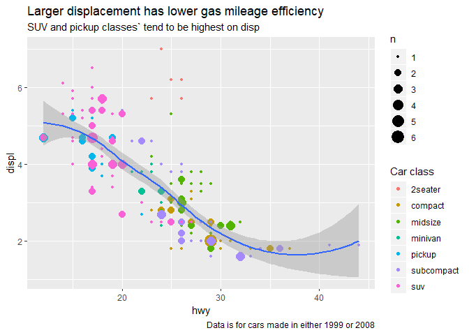
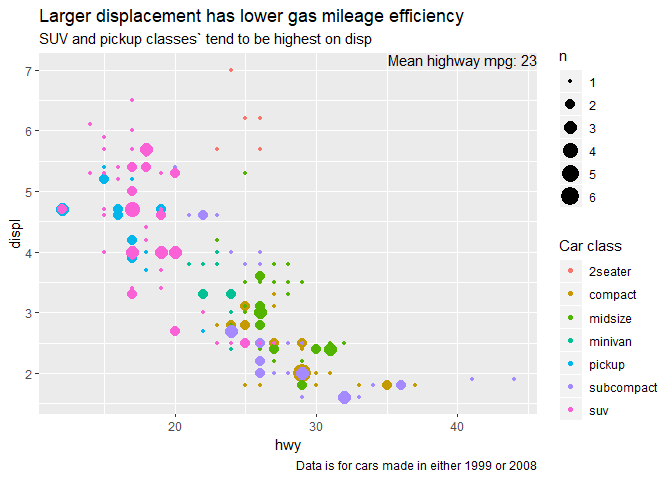
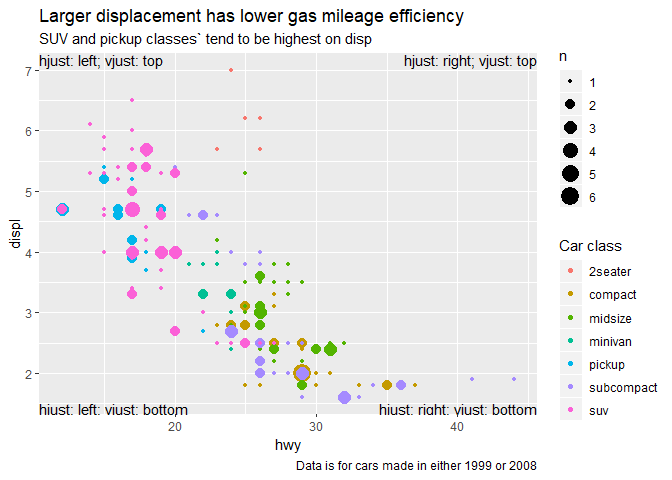
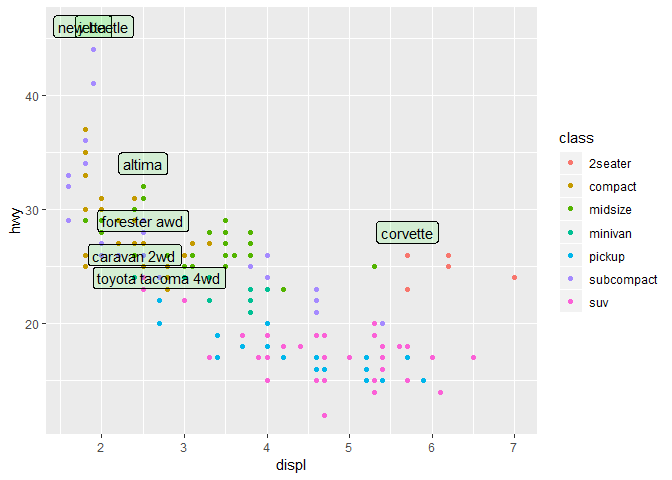
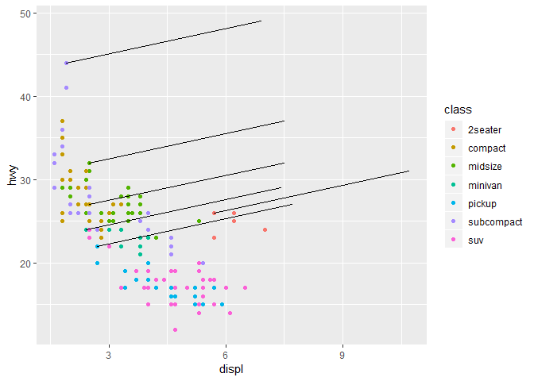
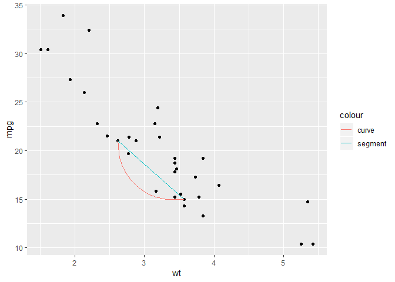
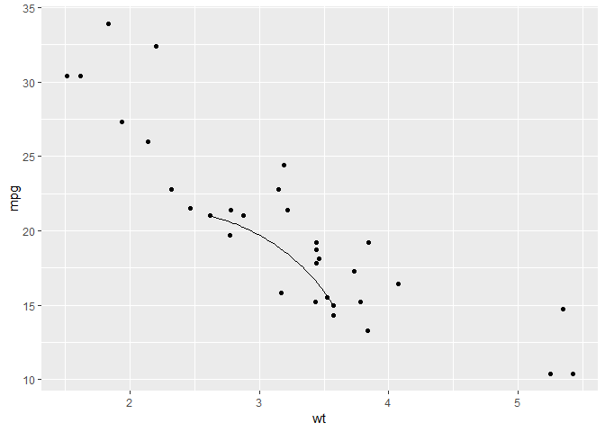
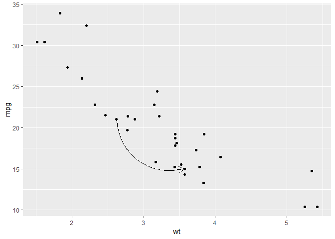
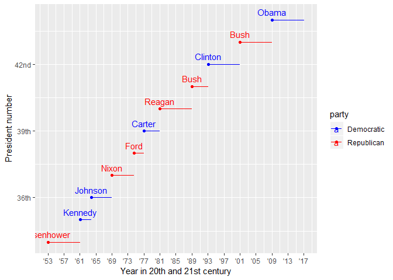

Graphics for communication
================
Bryan Shalloway
Last updated: 2019-05-10

  - [ch. 28: Graphics for
    communication](#ch.-28-graphics-for-communication)
      - [28.2: Label](#label)
          - [28.2.1](#section)
      - [28.3: Annotations](#annotations)
          - [28.3.1](#section-1)
      - [28.4: Scales](#scales)
          - [28.4.4](#section-2)

*Make sure the following packages are installed:*

# ch. 28: Graphics for communication

  - `labs()` to add labels
      - common args: `title`, `subtitle`, `caption`, `x`, `y`, `colour`,
        …
      - for mathematical equations use `quote` and see `?plotmath`
          - e.g. within `labs()` could do `y = quote(alpha + beta +
            frac(delta, theta))`
  - `geom_text()` similar to `geom_point()` but with argument `label`
    that adds text where the point would be
      - use `nudge_x` and `nudge_y` to move position around
      - use `vjust` (‘top’, ‘center’, or ‘bottom’) and `hjust` (‘left’,
        ‘center’, or ‘right’) to control alignment of text
      - can use `+Inf` and `-Inf` to put text in exact corners
      - use `stringr::str_wrap()` to automatically add line breaks
      - `geom_label()` is like `geom_text()` but draws a box around the
        data that makes easier to see (can adjust `alpha` and `fill` of
        background box)
      - `ggrepel::geom_label_repel()` is like `geom_label()` but
        prevents overlap of labels
  - `geom_hline()` and `geom_vline` for reference lines (often use `size
    = 2` and `colour = white`)
  - `geom_rect()` to draw rectangle around points (controlled by `xmin`,
    `xmax`, `ymin`, `ymax`)
  - `geom_segment()` to draw attention to a point with an arrow, (common
    args: `arrow`, `x`, `y`, `xend`, `yend`)
  - `annotate` can add in labels by hand (not from values of dataframe)
  - `scale_x_continuous()`, `scale_y_continuous()`,
    `scale_colour_discrete()`, … `scale_{aes}_{scale type}()`
      - `breaks` and `labels` are key args (can set `labels = NULL` to
        remove values)
      - `scale_colour_brewer(palette = "Set1")`for color blind people
      - `scale_colour_manual()` for definining colours with specific
        values, e.g. `scale_colour_manual(values = c(Republican = "red",
        Democratic = "blue"))`
      - for continuous scales try `scale_colour_gradient()`,
        `scale_fill_gradient()`, `scale_colour_gradient2()` (two colour
        gradient, e.g. + / - values), `viridis::scale_colour_viridis()`
      - date scales are a little different, e.g. `scale_x_date()` takes
        args `date_labels` (e.g. `date_labels = "'%y"`) and
        `date_breaks` (e.g. `date_breaks = "2 days"`)
      - `scale_x_log10()`, `scale_y_log10`… to substitute values with a
        particular transformation
  - `theme()` customize any non-data components of plots
      - e.g. remove legend with `theme(legend.position = "none")` (could
        also have inputted “left”, “top”, “bottom”, or “right”)
  - `guides()` to control display of individual legends – use in
    conjunction with `guide_legend()` or `guide_colourbar()`
  - `coord_cartesian()` to zoom using `xlim` and `ylim` args
  - can customize your themes, e.g. `theme_bw()`, `theme_classic()`…,
    see `ggthemes` for a bunch of others
  - `ggsave()` defaults to save most recent plot
      - key options: `fig.width`, `fig.height`, `fig.asp`, `out.width`,
        `out.height` (see chapter for details)
      - other options: `fig.align`, `fig.cap`, `dev` (e.g. `dev =
        "png"`)

## 28.2: Label

### 28.2.1

1.  Create one plot on the fuel economy data with customised `title`,
    `subtitle`, `caption`, `x`, `y`, and `colour` labels.
    
    ``` r
    mpg %>% 
      ggplot(aes(x = hwy, displ))+
      geom_count(aes(colour = class))+
      labs(title = "Larger displacement has lower gas mileage efficiency",
           subtitle = "SUV and pickup classes` tend to be highest on disp",
           caption = "Data is for cars made in either 1999 or 2008",
           colour = "Car class")
    ```
    
    <!-- -->

2.  The `geom_smooth()` is somewhat misleading because the `hwy` for
    large engines is skewed upwards due to the inclusion of lightweight
    sports cars with big engines. Use your modelling tools to fit and
    display a better model.
    
    ``` r
    mpg %>% 
      ggplot(aes(x = hwy, displ))+
      geom_count(aes(colour = class))+
      labs(title = "Larger displacement has lower gas mileage efficiency",
           subtitle = "SUV and pickup classes` tend to be highest on disp",
           caption = "Data is for cars made in either 1999 or 2008",
           colour = "Car class")+
      geom_smooth()
    ```
    
    <!-- -->
    
    You could take into account the class of the car
    
    ``` r
    mpg %>% 
      ggplot(aes(x = hwy, displ, colour = class))+
      geom_count()+
      labs(title = "Larger displacement has lower gas mileage efficiency",
           subtitle = "SUV and pickup classes` tend to be highest on disp",
           caption = "Data is for cars made in either 1999 or 2008",
           colour = "Car class")+
      geom_smooth()
    ```
    
        ## Warning in simpleLoess(y, x, w, span, degree = degree, parametric =
        ## parametric, : span too small. fewer data values than degrees of freedom.
    
        ## Warning in simpleLoess(y, x, w, span, degree = degree, parametric =
        ## parametric, : pseudoinverse used at 22.985
    
        ## Warning in simpleLoess(y, x, w, span, degree = degree, parametric =
        ## parametric, : neighborhood radius 2.015
    
        ## Warning in simpleLoess(y, x, w, span, degree = degree, parametric =
        ## parametric, : reciprocal condition number 0
    
        ## Warning in simpleLoess(y, x, w, span, degree = degree, parametric =
        ## parametric, : There are other near singularities as well. 1.0302
    
        ## Warning in predLoess(object$y, object$x, newx = if
        ## (is.null(newdata)) object$x else if (is.data.frame(newdata))
        ## as.matrix(model.frame(delete.response(terms(object)), : span too small.
        ## fewer data values than degrees of freedom.
    
        ## Warning in predLoess(object$y, object$x, newx = if
        ## (is.null(newdata)) object$x else if (is.data.frame(newdata))
        ## as.matrix(model.frame(delete.response(terms(object)), : pseudoinverse used
        ## at 22.985
    
        ## Warning in predLoess(object$y, object$x, newx = if
        ## (is.null(newdata)) object$x else if (is.data.frame(newdata))
        ## as.matrix(model.frame(delete.response(terms(object)), : neighborhood radius
        ## 2.015
    
        ## Warning in predLoess(object$y, object$x, newx = if
        ## (is.null(newdata)) object$x else if (is.data.frame(newdata))
        ## as.matrix(model.frame(delete.response(terms(object)), : reciprocal
        ## condition number 0
    
        ## Warning in predLoess(object$y, object$x, newx = if
        ## (is.null(newdata)) object$x else if (is.data.frame(newdata))
        ## as.matrix(model.frame(delete.response(terms(object)), : There are other
        ## near singularities as well. 1.0302
    
        ## Warning in simpleLoess(y, x, w, span, degree = degree, parametric =
        ## parametric, : pseudoinverse used at 24.035
    
        ## Warning in simpleLoess(y, x, w, span, degree = degree, parametric =
        ## parametric, : neighborhood radius 2.035
    
        ## Warning in simpleLoess(y, x, w, span, degree = degree, parametric =
        ## parametric, : reciprocal condition number 7.8765e-017
    
        ## Warning in simpleLoess(y, x, w, span, degree = degree, parametric =
        ## parametric, : There are other near singularities as well. 1
    
        ## Warning in predLoess(object$y, object$x, newx = if
        ## (is.null(newdata)) object$x else if (is.data.frame(newdata))
        ## as.matrix(model.frame(delete.response(terms(object)), : pseudoinverse used
        ## at 24.035
    
        ## Warning in predLoess(object$y, object$x, newx = if
        ## (is.null(newdata)) object$x else if (is.data.frame(newdata))
        ## as.matrix(model.frame(delete.response(terms(object)), : neighborhood radius
        ## 2.035
    
        ## Warning in predLoess(object$y, object$x, newx = if
        ## (is.null(newdata)) object$x else if (is.data.frame(newdata))
        ## as.matrix(model.frame(delete.response(terms(object)), : reciprocal
        ## condition number 7.8765e-017
    
        ## Warning in predLoess(object$y, object$x, newx = if
        ## (is.null(newdata)) object$x else if (is.data.frame(newdata))
        ## as.matrix(model.frame(delete.response(terms(object)), : There are other
        ## near singularities as well. 1
    
    <!-- -->

3.  Take an exploratory graphic that you’ve created in the last month,
    and add informative titles to make it easier for others to
    understand.
    
    Done seperately.

## 28.3: Annotations

### 28.3.1

1.  Use `geom_text()` with infinite positions to place text at the four
    corners of the
    plot.
    
    ``` r
    data_label <- tibble(x = Inf, y = Inf, label = paste0("Mean highway mpg: ", round(mean(mpg$hwy))))
    
    mpg %>% 
      ggplot(aes(x = hwy, displ))+
      geom_count(aes(colour = class))+
      labs(title = "Larger displacement has lower gas mileage efficiency",
           subtitle = "SUV and pickup classes` tend to be highest on disp",
           caption = "Data is for cars made in either 1999 or 2008",
           colour = "Car class")+
      geom_text(aes(x = x, y = y, label = label), data = data_label, vjust = "top", hjust = "right")
    ```
    
    <!-- -->
    
    You could technically create the lable w/o the tibble, though it
    will print multiple times for each row:
    
    ``` r
    mpg %>% 
      ggplot(aes(x = hwy, displ))+
      geom_count(aes(colour = class))+
      labs(title = "Larger displacement has lower gas mileage efficiency",
           subtitle = "SUV and pickup classes` tend to be highest on disp",
           caption = "Data is for cars made in either 1999 or 2008",
           colour = "Car class")+
      geom_text(x = Inf, y = Inf, label = paste0("Mean highway mpg: ", round(mean(mpg$hwy))), vjust = "top", hjust = "right")
    ```
    
    <!-- -->
    
    Place label in each of four courners:

<!-- end list -->

``` r
    data_label <- tibble(x = c(Inf, -Inf), 
           hjust = c("right", "left"), 
           y = c(Inf, -Inf),
           vjust = c("top", "bottom")) %>% 
      expand(nesting(x, hjust), nesting(y, vjust)) %>% 
      mutate(label = glue::glue("hjust: {hjust}; vjust: {vjust}"))

    mpg %>% 
      ggplot(aes(x = hwy, displ))+
      geom_count(aes(colour = class))+
      labs(title = "Larger displacement has lower gas mileage efficiency",
           subtitle = "SUV and pickup classes` tend to be highest on disp",
           caption = "Data is for cars made in either 1999 or 2008",
           colour = "Car class")+
      geom_text(aes(x = x, y = y, label = label, hjust = hjust, vjust = vjust),
                data = data_label)
```

<!-- -->

1.  Read the documentation for `annotate()`. How can you use it to add a
    text label to a plot without having to create a tibble?
    
    ``` r
    mpg %>% 
      ggplot(aes(x = hwy, displ))+
      geom_count(aes(colour = class))+
      labs(title = "Larger displacement has lower gas mileage efficiency",
           subtitle = "SUV and pickup classes` tend to be highest on disp",
           caption = "Data is for cars made in either 1999 or 2008",
           colour = "Car class")+
      annotate("text", x = Inf, y = Inf, label = paste0("Mean highway mpg: ", round(mean(mpg$hwy))), vjust = "top", hjust = "right")
    ```
    
    <!-- -->
    
      - function adds geoms, but not mapped from variables of a
        dataframe, so can pass in small items or single labels
      - can specify the geom type with annotate

2.  How do labels with `geom_text()` interact with faceting? How can you
    add a label to a single facet? How can you put a different label in
    each facet? (Hint: think about the underlying
    data.)
    
    ``` r
    data_label_single <- tibble(x = Inf, y = Inf, label = paste0("Mean highway mpg: ", round(mean(mpg$hwy))))
    
    data_label <- mpg %>% 
      group_by(class) %>% 
      summarise(hwy = round(mean(hwy))) %>% 
      mutate(label = paste0("hwy mpg for ", class, ": ", hwy)) %>% 
      mutate(x = Inf, y = Inf)
    
    mpg %>% 
      ggplot(aes(x = hwy, displ))+
      geom_count(aes(colour = class))+
      labs(title = "Larger displacement has lower gas mileage efficiency",
           subtitle = "SUV and pickup classes` tend to be highest on disp",
           caption = "Data is for cars made in either 1999 or 2008",
           colour = "Car class")+
      facet_wrap(~class)+
      geom_smooth()+
      geom_text(aes(x = x, y = y, label = label), data = data_label, vjust = "top", hjust = "right")
    ```
    
        ## Warning in simpleLoess(y, x, w, span, degree = degree, parametric =
        ## parametric, : span too small. fewer data values than degrees of freedom.
    
        ## Warning in simpleLoess(y, x, w, span, degree = degree, parametric =
        ## parametric, : pseudoinverse used at 22.985
    
        ## Warning in simpleLoess(y, x, w, span, degree = degree, parametric =
        ## parametric, : neighborhood radius 2.015
    
        ## Warning in simpleLoess(y, x, w, span, degree = degree, parametric =
        ## parametric, : reciprocal condition number 0
    
        ## Warning in simpleLoess(y, x, w, span, degree = degree, parametric =
        ## parametric, : There are other near singularities as well. 1.0302
    
        ## Warning in predLoess(object$y, object$x, newx = if
        ## (is.null(newdata)) object$x else if (is.data.frame(newdata))
        ## as.matrix(model.frame(delete.response(terms(object)), : span too small.
        ## fewer data values than degrees of freedom.
    
        ## Warning in predLoess(object$y, object$x, newx = if
        ## (is.null(newdata)) object$x else if (is.data.frame(newdata))
        ## as.matrix(model.frame(delete.response(terms(object)), : pseudoinverse used
        ## at 22.985
    
        ## Warning in predLoess(object$y, object$x, newx = if
        ## (is.null(newdata)) object$x else if (is.data.frame(newdata))
        ## as.matrix(model.frame(delete.response(terms(object)), : neighborhood radius
        ## 2.015
    
        ## Warning in predLoess(object$y, object$x, newx = if
        ## (is.null(newdata)) object$x else if (is.data.frame(newdata))
        ## as.matrix(model.frame(delete.response(terms(object)), : reciprocal
        ## condition number 0
    
        ## Warning in predLoess(object$y, object$x, newx = if
        ## (is.null(newdata)) object$x else if (is.data.frame(newdata))
        ## as.matrix(model.frame(delete.response(terms(object)), : There are other
        ## near singularities as well. 1.0302
    
        ## Warning in simpleLoess(y, x, w, span, degree = degree, parametric =
        ## parametric, : pseudoinverse used at 24.035
    
        ## Warning in simpleLoess(y, x, w, span, degree = degree, parametric =
        ## parametric, : neighborhood radius 2.035
    
        ## Warning in simpleLoess(y, x, w, span, degree = degree, parametric =
        ## parametric, : reciprocal condition number 7.8765e-017
    
        ## Warning in simpleLoess(y, x, w, span, degree = degree, parametric =
        ## parametric, : There are other near singularities as well. 1
    
        ## Warning in predLoess(object$y, object$x, newx = if
        ## (is.null(newdata)) object$x else if (is.data.frame(newdata))
        ## as.matrix(model.frame(delete.response(terms(object)), : pseudoinverse used
        ## at 24.035
    
        ## Warning in predLoess(object$y, object$x, newx = if
        ## (is.null(newdata)) object$x else if (is.data.frame(newdata))
        ## as.matrix(model.frame(delete.response(terms(object)), : neighborhood radius
        ## 2.035
    
        ## Warning in predLoess(object$y, object$x, newx = if
        ## (is.null(newdata)) object$x else if (is.data.frame(newdata))
        ## as.matrix(model.frame(delete.response(terms(object)), : reciprocal
        ## condition number 7.8765e-017
    
        ## Warning in predLoess(object$y, object$x, newx = if
        ## (is.null(newdata)) object$x else if (is.data.frame(newdata))
        ## as.matrix(model.frame(delete.response(terms(object)), : There are other
        ## near singularities as well. 1
    
    <!-- -->

3.  What arguments to `geom_label()` control the appearance of the
    background box?
    
      - `fill` argument controls background color
      - `alpha` controls it’s relative brighness
    
    <!-- end list -->
    
    ``` r
    best_in_class <- mpg %>%
      group_by(class) %>%
      filter(row_number(desc(hwy)) == 1)
    
    ggplot(mpg, aes(displ, hwy)) +
      geom_point(aes(colour = class)) +
      geom_label(aes(label = model), data = best_in_class, nudge_y = 2, alpha = 0.1, fill = "green")
    ```
    
    <!-- -->

4.  What are the four arguments to `arrow()`? How do they work? Create a
    series of plots that demonstrate the most important options.
    
    ``` r
    ggplot(mpg, aes(displ, hwy)) +
      geom_point(aes(colour = class)) +
      geom_segment(aes(xend = displ +5, yend = hwy + 5), data = best_in_class, lineend = "round")
    ```
    
    <!-- -->
    
    ``` r
    b <- ggplot(mtcars, aes(wt, mpg)) +
      geom_point()
    
    df <- data.frame(x1 = 2.62, x2 = 3.57, y1 = 21.0, y2 = 15.0)
    b +
     geom_curve(aes(x = x1, y = y1, xend = x2, yend = y2, colour = "curve"), data = df) +
     geom_segment(aes(x = x1, y = y1, xend = x2, yend = y2, colour = "segment"), data = df)
    ```
    
    <!-- -->
    
    ``` r
    b + geom_curve(aes(x = x1, y = y1, xend = x2, yend = y2), data = df, curvature = -0.2)
    ```
    
    <!-- -->
    
    ``` r
    b + geom_curve(aes(x = x1, y = y1, xend = x2, yend = y2), data = df, curvature = 1)
    ```
    
    <!-- -->
    
    ``` r
    b + geom_curve(
      aes(x = x1, y = y1, xend = x2, yend = y2),
      data = df,
      arrow = arrow(length = unit(0.03, "npc"))
    )
    ```
    
    <!-- -->
    
      - `angle` (in degrees), `length` (use `unit()` function to specify
        with number and type, e.g. “inches”), `ends` (“last”, “first”,
        or “both” – specifying which end), `type` (“open” or “closed”)

## 28.4: Scales

### 28.4.4

1.  Why doesn’t the following code override the default scale?
    
    ``` r
    df <- tibble(x = rnorm(100), y = rnorm(100))
    
    ggplot(df, aes(x, y)) +
      geom_hex() +
      scale_colour_gradient(low = "white", high = "red") +
      coord_fixed()
    ```
    
      - `geom_hex` uses `fill`, not `colour`
    
    <!-- end list -->
    
    ``` r
    df <- tibble(x = rnorm(100), y = rnorm(100))
    
    ggplot(df, aes(x, y)) +
      geom_hex() +
      scale_fill_gradient(low = "white", high = "red") +
      coord_fixed()
    ```
    
    ``` r
    ggplot(df, aes(x, y)) +
      geom_hex() +
      # scale_fill_gradient(low = "white", high = "red") +
      coord_fixed()
    ```

2.  What is the first argument to every scale? How does it compare to
    `labs()`?
    
      - `name`, i.e. what the title will be for that axis/legend/…
        `labs` first argument is `...` so requires you to name the input

3.  Change the display of the presidential terms by:
    
    1.  Combining the two variants shown above.
    2.  Improving the display of the y axis.
    3.  Labelling each term with the name of the president.
    4.  Adding informative plot labels.
    5.  Placing breaks every 4 years (this is trickier than it seems\!).

<!-- end list -->

``` r
presidential %>%
  mutate(id = 33L + row_number()) %>%
  ggplot(aes(start, id, colour = party)) +
  geom_point() +
  geom_segment(aes(xend = end, yend = id)) +
  geom_text(aes(label = name), vjust = "bottom", nudge_y = 0.2)+
  scale_colour_manual(values = c(Republican = "red", Democratic = "blue"))+
  scale_x_date("Year in 20th and 21st century", date_breaks = "4 years", date_labels = "'%y")+
  # scale_x_date(NULL, breaks = presidential$start, date_labels = "'%y")+
  scale_y_continuous(breaks = c(36, 39, 42), labels = c("36th", "39th", "42nd"))+
  labs(y = "President number", x = "Year")
```

<!-- -->

1.  Use `override.aes` to make the legend on the following plot easier
    to see.
    
    ``` r
    diamonds %>% 
      ggplot(aes(carat, price)) +
      geom_point(aes(colour = cut), alpha = 1/20)+
      guides(colour = guide_legend(override.aes = list(alpha = 1)))
    ```
    
    
