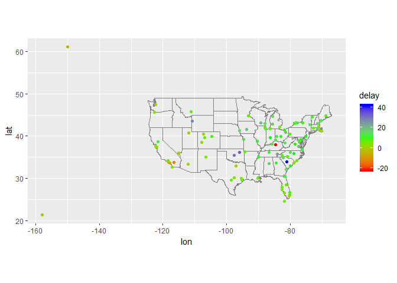
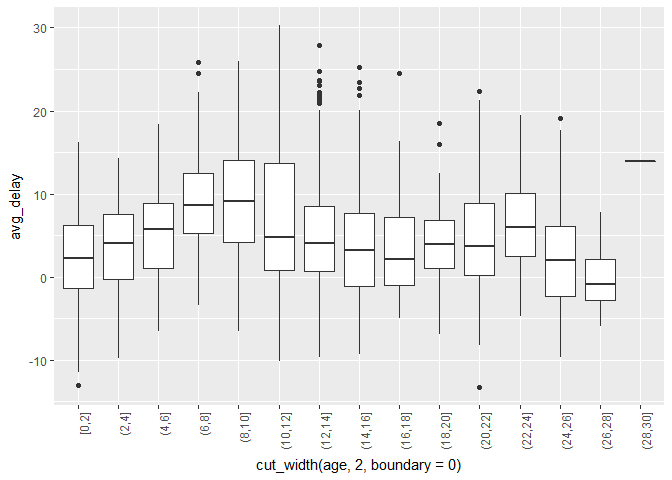
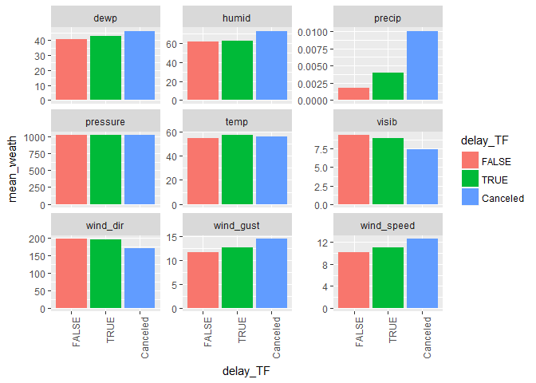
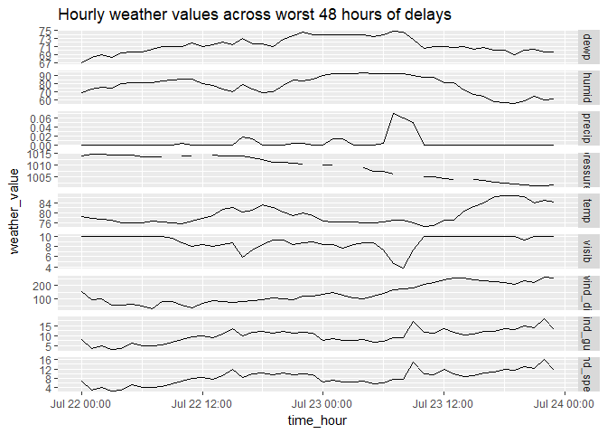
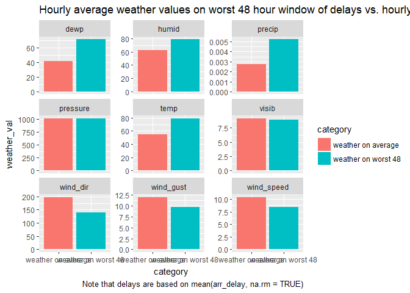
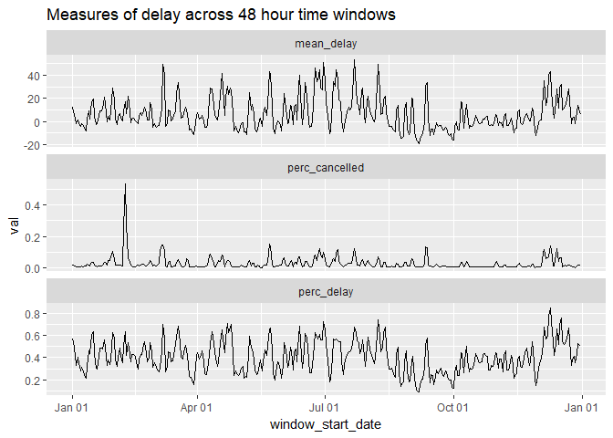
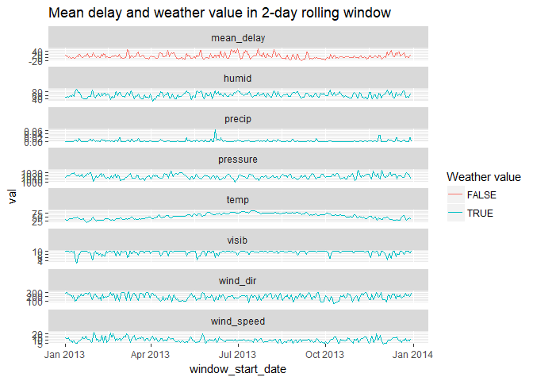
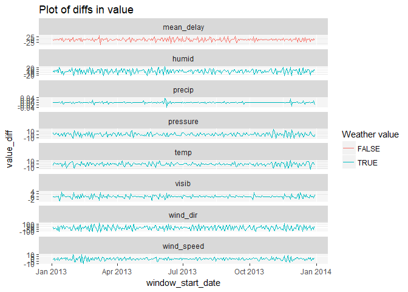

Chapter 13
================
Bryan Shalloway
Last updated: 2018-03-07

-   [ch. 13: Relational data](#ch.-13-relational-data)
    -   [13.2 nycflights13](#nycflights13)
        -   [13.2.1](#section)
    -   [13.3 Keys](#keys)
        -   [13.3.1](#section-1)
    -   [13.4 Mutating joins](#mutating-joins)
        -   [13.4.6](#section-2)
    -   [13.5 Filtering joins](#filtering-joins)
        -   [13.5.1](#section-3)
-   [Appendix](#appendix)
    -   [13.5.1.4](#section-4)

*Make sure the following packages are installed:*

ch. 13: Relational data
=======================

> "The relations of three or more tables are always a property of the relations between each pairs."

*Three families of verbs in relational data: *

-   **Mutating joins**, which add new variables to one data frame from matching observations in another.

-   **Filtering joins**, which filter observations from one data frame based on whether or not they match an observation in the other table.

-   **Set operations**, which treat observations as if they were set elements.

13.2 nycflights13
-----------------

``` r
flights
airlines
airports
planes
weather
```

### 13.2.1

1.  *Imagine you wanted to draw (approximately) the route each plane flies from* *its origin to its destination. What variables would you need? What tables* *would you need to combine?*

    To draw a line from origin to destination, I need the lat lon points from airports`as well as the dest and origin variables from`flights\`.

2.  *I forgot to draw the relationship between `weather` and `airports`.* *What is the relationship and how should it appear in the diagram?*

    `origin` from `weather connects to`faa`from`airports\` in a many to one relationship

3.  *`weather` only contains information for the origin (NYC) airports. If* *it contained weather records for all airports in the USA, what additional* *relation would it define with `flights`?*

    It would connect to `dest`.

4.  *We know that some days of the year are "special", and fewer people than* *usual fly on them. How might you represent that data as a data frame?* *What would be the primary keys of that table? How would it connect to the* *existing tables?*

    Make a set of days that are less popular and have these dates connect by month and day

13.3 Keys
---------

### 13.3.1

1.  *Add a surrogate key to `flights`.*

``` r
flights %>%
  mutate(surrogate_key = row_number()) %>% 
  glimpse()
```

    ## Observations: 336,776
    ## Variables: 20
    ## $ year           <int> 2013, 2013, 2013, 2013, 2013, 2013, 2013, 2013,...
    ## $ month          <int> 1, 1, 1, 1, 1, 1, 1, 1, 1, 1, 1, 1, 1, 1, 1, 1,...
    ## $ day            <int> 1, 1, 1, 1, 1, 1, 1, 1, 1, 1, 1, 1, 1, 1, 1, 1,...
    ## $ dep_time       <int> 517, 533, 542, 544, 554, 554, 555, 557, 557, 55...
    ## $ sched_dep_time <int> 515, 529, 540, 545, 600, 558, 600, 600, 600, 60...
    ## $ dep_delay      <dbl> 2, 4, 2, -1, -6, -4, -5, -3, -3, -2, -2, -2, -2...
    ## $ arr_time       <int> 830, 850, 923, 1004, 812, 740, 913, 709, 838, 7...
    ## $ sched_arr_time <int> 819, 830, 850, 1022, 837, 728, 854, 723, 846, 7...
    ## $ arr_delay      <dbl> 11, 20, 33, -18, -25, 12, 19, -14, -8, 8, -2, -...
    ## $ carrier        <chr> "UA", "UA", "AA", "B6", "DL", "UA", "B6", "EV",...
    ## $ flight         <int> 1545, 1714, 1141, 725, 461, 1696, 507, 5708, 79...
    ## $ tailnum        <chr> "N14228", "N24211", "N619AA", "N804JB", "N668DN...
    ## $ origin         <chr> "EWR", "LGA", "JFK", "JFK", "LGA", "EWR", "EWR"...
    ## $ dest           <chr> "IAH", "IAH", "MIA", "BQN", "ATL", "ORD", "FLL"...
    ## $ air_time       <dbl> 227, 227, 160, 183, 116, 150, 158, 53, 140, 138...
    ## $ distance       <dbl> 1400, 1416, 1089, 1576, 762, 719, 1065, 229, 94...
    ## $ hour           <dbl> 5, 5, 5, 5, 6, 5, 6, 6, 6, 6, 6, 6, 6, 6, 6, 5,...
    ## $ minute         <dbl> 15, 29, 40, 45, 0, 58, 0, 0, 0, 0, 0, 0, 0, 0, ...
    ## $ time_hour      <dttm> 2013-01-01 05:00:00, 2013-01-01 05:00:00, 2013...
    ## $ surrogate_key  <int> 1, 2, 3, 4, 5, 6, 7, 8, 9, 10, 11, 12, 13, 14, ...

1.  *Identify the keys in the following datasets*

    1.  `Lahman::Batting`: player, year, stint

    ``` r
    Lahman::Batting %>% 
      count(playerID, yearID, stint) %>% 
      filter(n > 1)
    ```

        ## # A tibble: 0 x 4
        ## # ... with 4 variables: playerID <chr>, yearID <int>, stint <int>, n <int>

    1.  `babynames::babynames`: name, sex, year

    ``` r
    babynames::babynames %>% 
      count(name, sex, year) %>% 
      filter(nn > 1)
    ```

        ## # A tibble: 0 x 4
        ## # ... with 4 variables: name <chr>, sex <chr>, year <dbl>, nn <int>

    1.  `nasaweather::atmos`: lat, long, year, month

    ``` r
    nasaweather::atmos %>% 
      count(lat, long, year, month) %>% 
      filter(n > 1)
    ```

        ## # A tibble: 0 x 5
        ## # ... with 5 variables: lat <dbl>, long <dbl>, year <int>, month <int>,
        ## #   n <int>

    1.  `fueleconomy::vehicles`: id

    ``` r
    fueleconomy::vehicles %>% 
      count(id) %>% 
      filter(n > 1)
    ```

        ## # A tibble: 0 x 2
        ## # ... with 2 variables: id <int>, n <int>

    1.  `ggplot2::diamonds`: needs surrogate

``` r
diamonds %>% 
  count(x, y, z, depth, table, carat, cut, color, price, clarity ) %>% 
  filter(n > 1)
```

    ## # A tibble: 143 x 11
    ##        x     y     z depth table carat       cut color price clarity     n
    ##    <dbl> <dbl> <dbl> <dbl> <dbl> <dbl>     <ord> <ord> <int>   <ord> <int>
    ##  1  0.00  0.00  0.00  64.1    60  0.71      Good     F  2130     SI2     2
    ##  2  4.23  4.26  2.69  63.4    57  0.30      Good     J   394     VS1     2
    ##  3  4.26  4.23  2.69  63.4    57  0.30 Very Good     J   506     VS1     2
    ##  4  4.26  4.29  2.66  62.2    57  0.30     Ideal     H   450     SI1     2
    ##  5  4.27  4.28  2.66  62.2    57  0.30     Ideal     H   450     SI1     2
    ##  6  4.29  4.31  2.71  63.0    55  0.30 Very Good     G   526     VS2     2
    ##  7  4.29  4.31  2.73  63.5    56  0.31      Good     D   571     SI1     2
    ##  8  4.31  4.28  2.67  62.2    58  0.30   Premium     D   709     SI1     2
    ##  9  4.31  4.29  2.71  63.0    55  0.30     Ideal     G   675     VS2     2
    ## 10  4.31  4.29  2.73  63.5    56  0.31 Very Good     D   732     SI1     2
    ## # ... with 133 more rows

``` r
diamonds %>% 
  mutate(surrogate_id = row_number())
```

    ## # A tibble: 53,940 x 11
    ##    carat       cut color clarity depth table price     x     y     z
    ##    <dbl>     <ord> <ord>   <ord> <dbl> <dbl> <int> <dbl> <dbl> <dbl>
    ##  1  0.23     Ideal     E     SI2  61.5    55   326  3.95  3.98  2.43
    ##  2  0.21   Premium     E     SI1  59.8    61   326  3.89  3.84  2.31
    ##  3  0.23      Good     E     VS1  56.9    65   327  4.05  4.07  2.31
    ##  4  0.29   Premium     I     VS2  62.4    58   334  4.20  4.23  2.63
    ##  5  0.31      Good     J     SI2  63.3    58   335  4.34  4.35  2.75
    ##  6  0.24 Very Good     J    VVS2  62.8    57   336  3.94  3.96  2.48
    ##  7  0.24 Very Good     I    VVS1  62.3    57   336  3.95  3.98  2.47
    ##  8  0.26 Very Good     H     SI1  61.9    55   337  4.07  4.11  2.53
    ##  9  0.22      Fair     E     VS2  65.1    61   337  3.87  3.78  2.49
    ## 10  0.23 Very Good     H     VS1  59.4    61   338  4.00  4.05  2.39
    ## # ... with 53,930 more rows, and 1 more variables: surrogate_id <int>

1.  *Draw a diagram illustrating the connections between the `Batting`,* *`Master`, and `Salaries` tables in the Lahman package. Draw another diagram* *that shows the relationship between `Master`, `Managers`, `AwardsManagers`.*

    For each dataset show just the `head(1)`

    Combine by playerid

        ##    playerID yearID stint teamID lgID G AB R H X2B X3B HR RBI SB CS BB SO
        ## 1 abercda01   1871     1    TRO   NA 1  4 0 0   0   0  0   0  0  0  0  0
        ##   IBB HBP SH SF GIDP
        ## 1  NA  NA NA NA   NA

        ##    playerID birthYear birthMonth birthDay birthCountry birthState
        ## 1 aardsda01      1981         12       27          USA         CO
        ##   birthCity deathYear deathMonth deathDay deathCountry deathState
        ## 1    Denver        NA         NA       NA         <NA>       <NA>
        ##   deathCity nameFirst nameLast   nameGiven weight height bats throws
        ## 1      <NA>     David  Aardsma David Allan    215     75    R      R
        ##        debut  finalGame  retroID   bbrefID deathDate  birthDate
        ## 1 2004-04-06 2015-08-23 aardd001 aardsda01      <NA> 1981-12-27

    Combine by playerID, yearID

        ##    playerID yearID stint teamID lgID G AB R H X2B X3B HR RBI SB CS BB SO
        ## 1 abercda01   1871     1    TRO   NA 1  4 0 0   0   0  0   0  0  0  0  0
        ##   IBB HBP SH SF GIDP
        ## 1  NA  NA NA NA   NA

        ##   yearID teamID lgID  playerID salary
        ## 1   1985    ATL   NL barkele01 870000

    Combine by playerID

        ##    playerID birthYear birthMonth birthDay birthCountry birthState
        ## 1 aardsda01      1981         12       27          USA         CO
        ##   birthCity deathYear deathMonth deathDay deathCountry deathState
        ## 1    Denver        NA         NA       NA         <NA>       <NA>
        ##   deathCity nameFirst nameLast   nameGiven weight height bats throws
        ## 1      <NA>     David  Aardsma David Allan    215     75    R      R
        ##        debut  finalGame  retroID   bbrefID deathDate  birthDate
        ## 1 2004-04-06 2015-08-23 aardd001 aardsda01      <NA> 1981-12-27

        ##   yearID teamID lgID  playerID salary
        ## 1   1985    ATL   NL barkele01 870000

    Connect by playerID

        ##    playerID birthYear birthMonth birthDay birthCountry birthState
        ## 1 aardsda01      1981         12       27          USA         CO
        ##   birthCity deathYear deathMonth deathDay deathCountry deathState
        ## 1    Denver        NA         NA       NA         <NA>       <NA>
        ##   deathCity nameFirst nameLast   nameGiven weight height bats throws
        ## 1      <NA>     David  Aardsma David Allan    215     75    R      R
        ##        debut  finalGame  retroID   bbrefID deathDate  birthDate
        ## 1 2004-04-06 2015-08-23 aardd001 aardsda01      <NA> 1981-12-27

        ##    playerID yearID teamID lgID inseason  G  W  L rank plyrMgr
        ## 1 wrighha01   1871    BS1   NA        1 31 20 10    3       Y

    Connect by playerID

        ##    playerID birthYear birthMonth birthDay birthCountry birthState
        ## 1 aardsda01      1981         12       27          USA         CO
        ##   birthCity deathYear deathMonth deathDay deathCountry deathState
        ## 1    Denver        NA         NA       NA         <NA>       <NA>
        ##   deathCity nameFirst nameLast   nameGiven weight height bats throws
        ## 1      <NA>     David  Aardsma David Allan    215     75    R      R
        ##        debut  finalGame  retroID   bbrefID deathDate  birthDate
        ## 1 2004-04-06 2015-08-23 aardd001 aardsda01      <NA> 1981-12-27

        ##    playerID                   awardID yearID lgID  tie notes
        ## 1 larusto01 BBWAA Manager of the Year   1983   AL <NA>    NA

    *How would you characterise the relationship between the `Batting`,* *`Pitching`, and `Fielding` tables?*

    All connect by playerID, yearID, stint

        ##    playerID yearID stint teamID lgID G AB R H X2B X3B HR RBI SB CS BB SO
        ## 1 abercda01   1871     1    TRO   NA 1  4 0 0   0   0  0   0  0  0  0  0
        ##   IBB HBP SH SF GIDP
        ## 1  NA  NA NA NA   NA

        ##    playerID yearID stint teamID lgID W L G GS CG SHO SV IPouts  H ER HR BB
        ## 1 bechtge01   1871     1    PH1   NA 1 2 3  3  2   0  0     78 43 23  0 11
        ##   SO BAOpp  ERA IBB WP HBP BK BFP GF  R SH SF GIDP
        ## 1  1    NA 7.96  NA NA  NA  0  NA NA 42 NA NA   NA

        ##    playerID yearID stint teamID lgID POS G GS InnOuts PO A E DP PB WP SB
        ## 1 abercda01   1871     1    TRO   NA  SS 1 NA      NA  1 3 2  0 NA NA NA
        ##   CS ZR
        ## 1 NA NA

13.4 Mutating joins
-------------------

> The most commonly used join is the left join: you use this whenever you look up additional data from another table, because it preserves the original observations even when there isn't a match.

### 13.4.6

1.  *Compute the average delay by destination, then join on the `airports`* *data frame so you can show the spatial distribution of delays. Here's an* *easy way to draw a map of the United States:*

    ``` r
    airports %>%
      semi_join(flights, c("faa" = "dest")) %>%
      ggplot(aes(lon, lat)) +
      borders("state") +
      geom_point() +
      coord_quickmap()
    ```

    Now adding in colour by average delay.

    ``` r
    flights %>% 
      semi_join(airports, c("dest" = "faa")) %>%
      group_by(dest) %>% 
      summarise(delay = mean(arr_delay, na.rm=TRUE)) %>% 
      left_join(airports, by = c("dest"="faa")) %>% 
      ggplot(aes(lon, lat)) +
      borders("state") +
      geom_point(aes(colour = delay)) +
      coord_quickmap()+
      scale_color_gradientn(colours = rainbow(3))
    ```

        ## Warning: package 'maps' was built under R version 3.4.3

    

2.  *Add the location of the origin *and* destination (i.e. the `lat` and `lon`)* *to `flights`.*

    ``` r
    flights %>% 
      left_join(airports, by = c("dest" = "faa")) %>% 
      left_join(airports, by = c("origin" = "faa"), suffix=c("_dest", "_origin")) %>%
      select(flight, carrier, dest, lat_dest, lon_dest, origin, lat_origin, lon_origin)
    ```

        ## # A tibble: 336,776 x 8
        ##    flight carrier  dest lat_dest  lon_dest origin lat_origin lon_origin
        ##     <int>   <chr> <chr>    <dbl>     <dbl>  <chr>      <dbl>      <dbl>
        ##  1   1545      UA   IAH 29.98443 -95.34144    EWR   40.69250  -74.16867
        ##  2   1714      UA   IAH 29.98443 -95.34144    LGA   40.77725  -73.87261
        ##  3   1141      AA   MIA 25.79325 -80.29056    JFK   40.63975  -73.77893
        ##  4    725      B6   BQN       NA        NA    JFK   40.63975  -73.77893
        ##  5    461      DL   ATL 33.63672 -84.42807    LGA   40.77725  -73.87261
        ##  6   1696      UA   ORD 41.97860 -87.90484    EWR   40.69250  -74.16867
        ##  7    507      B6   FLL 26.07258 -80.15275    EWR   40.69250  -74.16867
        ##  8   5708      EV   IAD 38.94453 -77.45581    LGA   40.77725  -73.87261
        ##  9     79      B6   MCO 28.42939 -81.30899    JFK   40.63975  -73.77893
        ## 10    301      AA   ORD 41.97860 -87.90484    LGA   40.77725  -73.87261
        ## # ... with 336,766 more rows

    Note that the suffix allows you to tag names onto first and second table, hence why vector is length 2

3.  *Is there a relationship between the age of a plane and its delays?*

    ``` r
    group_by(flights, tailnum) %>% 
      summarise(avg_delay = mean(arr_delay, na.rm=TRUE), 
                n = n()) %>% 
      left_join(planes, by="tailnum") %>% 
      mutate(age = 2013 - year) %>% 
      filter(n > 50, age < 30) %>% 
      ggplot(aes(x = age, y = avg_delay))+
      geom_point()+
      geom_smooth()
    ```

    

    Looks as though planes that are 5 to 12 years old have higher delays... Let's look at same thing using boxplots.

    ``` r
    group_by(flights, tailnum) %>% 
      summarise(avg_delay = mean(arr_delay, na.rm=TRUE), 
                n = n()) %>% 
      left_join(planes, by="tailnum") %>% 
      mutate(age = 2013 - year) %>% 
      filter(n > 50, age <= 30, age >= 0) %>% 
      ggplot()+
      geom_boxplot(aes(x = cut_width(age, 2, boundary = 0), y = avg_delay))+
      theme(axis.text.x = element_text(angle = 90, hjust = 1))
    ```

    

    Perhaps there is not an overall trend association between age and delays, though it seems that the particular group of planes in that time range seem to have delays than either newer or older planes. On the other hand, there does almost look to be a seasonality pattern -- though this may just be me seeing things... perhaps worth exploring mroe.

4.  *What weather conditions make it more likely to see a delay?*

    There are a lot of ways you could have approached this problem. Below, I look at the average weather value for each of the groups `FALSE`, `TRUE` and `Canceled` -- `FALSE` corresponding with non-delayed flights, `TRUE` with delayed flights and `Canceled` with flights that were canceled. If I were feeling fancy, I would have also added the standard errors on these...

    ``` r
    flights_weath <- mutate(flights, delay_TF = dep_delay > 0) %>%
      separate(sched_dep_time, 
               into = c("hour_sched", "min_sched"), 
               sep = -3,
               remove = FALSE, 
               convert = TRUE) %>%
      left_join(weather, by = c("origin", "year","month", "day", "hour_sched"="hour"))

    flights_weath_gath <- flights_weath %>% 
      select(sched_dep_time, delay_TF, sched_dep_time, temp:visib) %>% 
      mutate(key = row_number()) %>% 
      gather(temp, dewp, humid, wind_dir, wind_speed, wind_gust, precip, pressure, visib, 
           key="weather", value="values") 

    flights_summarized <- flights_weath_gath %>% 
      group_by(weather, delay_TF) %>% 
      summarise(median_weath = median(values, na.rm = TRUE),
                mean_weath = mean(values, na.rm = TRUE), 
                sum_n = sum(!is.na(values))) %>% 
      ungroup() %>% 
      mutate(delay_TF = ifelse(is.na(delay_TF), "Canceled", delay_TF),
             delay_TF = forcats::as_factor(delay_TF, c(FALSE, TRUE, "Canceled")))

    flights_summarized %>%  
      ggplot(aes(x = delay_TF, y = mean_weath, fill = delay_TF))+
      geom_col()+
      facet_wrap(~weather, scales = "free_y")+
      theme(axis.text.x = element_text(angle = 90, hjust = 1))
    ```

    

    While precipitation is the largest difference, my guess is that the standard error on this would be much greater day to day because as you can see the values are very low, so it could be that a few cases with a lot of rain may tick it up, but it may be tough to actually use this as a predictor...

5.  *What happened on June 13 2013? Display the spatial pattern of delays,* *and then use Google to cross-reference with the weather.*

    Looks like East coast is getting hammered and flights arriving from Atlanta an similar locations were very delayed. Guessing either weather issue, or problem in Atl or delta.

13.5 Filtering joins
--------------------

### 13.5.1

1.  *What does it mean for a flight to have a missing `tailnum`?*

    All flights with a missing tailnum in the `flights` table were cancelled as you can see below.

    ``` r
    flights %>% 
      count(is.na(tailnum), is.na(arr_delay))
    ```

        ## # A tibble: 3 x 3
        ##   `is.na(tailnum)` `is.na(arr_delay)`      n
        ##              <lgl>              <lgl>  <int>
        ## 1            FALSE              FALSE 327346
        ## 2            FALSE               TRUE   6918
        ## 3             TRUE               TRUE   2512

    *What do the tail numbers that don't have a matching record in `planes` have in common?* *(Hint: one variable explains ~90% of the problems.)*

    ``` r
    flights %>% 
      anti_join(planes, by="tailnum") %>% 
      count(carrier, sort = TRUE)
    ```

        ## # A tibble: 10 x 2
        ##    carrier     n
        ##      <chr> <int>
        ##  1      MQ 25397
        ##  2      AA 22558
        ##  3      UA  1693
        ##  4      9E  1044
        ##  5      B6   830
        ##  6      US   699
        ##  7      FL   187
        ##  8      DL   110
        ##  9      F9    50
        ## 10      WN    38

    ``` r
    flights %>% 
      mutate(in_planes = tailnum %in% planes$tailnum) %>% 
      group_by(carrier, in_planes) %>% 
      summarise(flights_inPlanes = )
    ```

        ## # A tibble: 26 x 2
        ## # Groups:   carrier [?]
        ##    carrier in_planes
        ##      <chr>     <lgl>
        ##  1      9E     FALSE
        ##  2      9E      TRUE
        ##  3      AA     FALSE
        ##  4      AA      TRUE
        ##  5      AS      TRUE
        ##  6      B6     FALSE
        ##  7      B6      TRUE
        ##  8      DL     FALSE
        ##  9      DL      TRUE
        ## 10      EV      TRUE
        ## # ... with 16 more rows

    Some carriers do not have many of their tailnums data in the `planes` table. Anyone have more insight here?

2.  *Filter flights to only show flights with planes that have flown at least 100* *flights.*

    ``` r
    planes_many <- flights %>% 
      count(tailnum, sort=TRUE) %>% 
      filter(n > 100)

    semi_join(flights, planes_many)
    ```

        ## # A tibble: 229,202 x 19
        ##     year month   day dep_time sched_dep_time dep_delay arr_time
        ##    <int> <int> <int>    <int>          <int>     <dbl>    <int>
        ##  1  2013     1     1      517            515         2      830
        ##  2  2013     1     1      533            529         4      850
        ##  3  2013     1     1      544            545        -1     1004
        ##  4  2013     1     1      554            558        -4      740
        ##  5  2013     1     1      555            600        -5      913
        ##  6  2013     1     1      557            600        -3      709
        ##  7  2013     1     1      557            600        -3      838
        ##  8  2013     1     1      558            600        -2      849
        ##  9  2013     1     1      558            600        -2      853
        ## 10  2013     1     1      558            600        -2      923
        ## # ... with 229,192 more rows, and 12 more variables: sched_arr_time <int>,
        ## #   arr_delay <dbl>, carrier <chr>, flight <int>, tailnum <chr>,
        ## #   origin <chr>, dest <chr>, air_time <dbl>, distance <dbl>, hour <dbl>,
        ## #   minute <dbl>, time_hour <dttm>

3.  *Combine `fueleconomy::vehicles` and `fueleconomy::common` to find only the* *records for the most common models.*

    ``` r
    fueleconomy::vehicles %>% 
      semi_join(fueleconomy::common, by=c("make", "model"))
    ```

        ## # A tibble: 14,531 x 12
        ##       id  make   model  year           class           trans
        ##    <int> <chr>   <chr> <int>           <chr>           <chr>
        ##  1  1833 Acura Integra  1986 Subcompact Cars Automatic 4-spd
        ##  2  1834 Acura Integra  1986 Subcompact Cars    Manual 5-spd
        ##  3  3037 Acura Integra  1987 Subcompact Cars Automatic 4-spd
        ##  4  3038 Acura Integra  1987 Subcompact Cars    Manual 5-spd
        ##  5  4183 Acura Integra  1988 Subcompact Cars Automatic 4-spd
        ##  6  4184 Acura Integra  1988 Subcompact Cars    Manual 5-spd
        ##  7  5303 Acura Integra  1989 Subcompact Cars Automatic 4-spd
        ##  8  5304 Acura Integra  1989 Subcompact Cars    Manual 5-spd
        ##  9  6442 Acura Integra  1990 Subcompact Cars Automatic 4-spd
        ## 10  6443 Acura Integra  1990 Subcompact Cars    Manual 5-spd
        ## # ... with 14,521 more rows, and 6 more variables: drive <chr>, cyl <int>,
        ## #   displ <dbl>, fuel <chr>, hwy <int>, cty <int>

4.  *Find the 48 hours (over the course of the whole year) that have the worst* *delays. Cross-reference it with the `weather` data. Can you see any* *patterns?*

    First: Create two variables that together capture all 48 hour time windows across the year, at the day window of granularity (e.g. the time of day the flight takes off does not matter in establishing time windows for this example, only the day). Second: Gather these time windows into a single dataframe (note that this will increase the length of your data by ~364/365 \* 100 %) Third: Group by `window_start_date` and calculate average `arr_delay` and related metrics.

    ``` r
    delays_windows <- flights %>% 
      #First
      mutate(date_flight = lubridate::as_date(time_hour)) %>% 
      mutate(startdate_window1 = cut.Date(date_flight, "2 day")) %>% 
      mutate(date_flight2 = ifelse(!(date_flight == min(date_flight, na.rm = TRUE)), date_flight, NA),
             date_flight2 = lubridate::as_date(date_flight2),
             startdate_window2 = cut.Date(date_flight2, "2 day")) %>% 
      select(-date_flight, -date_flight2) %>% 
      #Second
      gather(startdate_window1, startdate_window2, key = "start_window", value = "window_start_date") %>% 
      filter(!is.na(window_start_date)) %>% 
      #Third
      group_by(window_start_date) %>% 
      summarise(num = n(),
                perc_cancelled = sum(is.na(arr_delay)) / n(),
                mean_delay = mean(arr_delay, na.rm = TRUE),
                perc_delay = mean(arr_delay > 0, na.rm = TRUE),
                total_delay_mins = sum(arr_delay, na.rm = TRUE)) %>% 
      ungroup()
    ```

        ## Warning: attributes are not identical across measure variables;
        ## they will be dropped

    ``` r
    #don't worry about warning of 'attributes are not identical...', that is
    #because the cut function assigns attributes to the value, it's fine if
    #these are dropped here.
    ```

    Create tibble of worst 2-day period for mean `arr_delay`

``` r
WorstWindow <- delays_windows %>% 
  mutate(mean_delay_rank = dplyr::min_rank(-mean_delay)) %>% 
  filter(mean_delay_rank <= 1)

WorstDates <- tibble(dates = c(lubridate::as_date(WorstWindow$window_start_date), lubridate::as_date(WorstWindow$window_start_date) + lubridate::duration(1, "days")))
```

Ammend weather data so that weather is an average across three NY locations rather than seperate for each [1]

``` r
weather_ammended <- weather %>% 
  mutate(time_hour = lubridate::make_datetime(year, month, day, hour)) %>% 
  select(-one_of("origin", "year", "month", "day", "hour")) %>% 
  group_by(time_hour) %>% 
  summarise_all(mean, na.rm = TRUE) %>% 
  ungroup()
```

Filtering join to just times weather for worst 2 days

``` r
weather_worst <- weather_ammended %>%
  mutate(dates = as_date(time_hour)) %>% 
  semi_join(WorstDates)
```

Plot of hourly weather values across 48 hour time windows.

``` r
weather_worst %>% 
  select(-dates) %>% 
  gather(temp:visib, key = "weather_type", value = "weather_value") %>% 
  ggplot(aes(x = time_hour, y = weather_value))+
  geom_line()+
  facet_grid(weather_type ~ ., scales = "free_y")
```



Patterns:

-   `wind_gust` and `wind_speed` are the same.
-   See high level of colinearity in spikes and changes, e.g. increase in `precip` corresponds with decrease in `visib` and perhaps uptick in `wind_spee`

Perhaps, we want to view how the average hourly weather values compare on the worst days to average weather days. Create summary of average hourly weather values for worst 48 hour period, for average period, and then append these and plot.

``` r
bind_rows(  
weather_worst %>% 
  summarise_at(vars(temp:visib), mean, na.rm = TRUE) %>% 
  mutate(category = "weather on worst 48") %>% 
  gather(temp:visib, key = weather_type, value = weather_val)
,
weather_ammended %>% 
  summarise_at(vars(temp:visib), mean, na.rm = TRUE) %>% 
  mutate(category = "weather on average") %>% 
  gather(temp:visib, key = weather_type, value = weather_val)
) %>% 
  ggplot(aes(x = category, y = weather_val, fill = category))+
  geom_col()+
  facet_wrap(~weather_type, scales = "free_y")+
  labs(title = "Hourly average weather values on worst 48 hour window of delays vs. hourly average weather across year", 
       caption = "Note that delays are based on mean(arr_delay, na.rm = TRUE)")
```



    I show plots and models of 48 hour time windows in a variety of contexts and detail in [13.5.1.4]

1.  *What does `anti_join(flights, airports, by = c("dest" = "faa"))` tell you?* *What does `anti_join(airports, flights, by = c("faa" = "dest"))` tell you?*

    `anti_join(flights, airports, by = c("dest" = "faa"))` --tells me the flight dests missing an airport `anti_join(airports, flights, by = c("faa" = "dest"))` -- tells me the airports with no flights coming to them

2.  *You might expect that there's an implicit relationship between plane* *and airline, because each plane is flown by a single airline. Confirm* *or reject this hypothesis using the tools you've learned above.*

    ``` r
    tail_carr <- flights %>% 
      filter(!is.na(tailnum)) %>% 
      distinct(carrier, tailnum) %>% 
      count(tailnum, sort=TRUE)

    tail_carr %>% 
      filter(n > 1)
    ```

        ## # A tibble: 17 x 2
        ##    tailnum     n
        ##      <chr> <int>
        ##  1  N146PQ     2
        ##  2  N153PQ     2
        ##  3  N176PQ     2
        ##  4  N181PQ     2
        ##  5  N197PQ     2
        ##  6  N200PQ     2
        ##  7  N228PQ     2
        ##  8  N232PQ     2
        ##  9  N933AT     2
        ## 10  N935AT     2
        ## 11  N977AT     2
        ## 12  N978AT     2
        ## 13  N979AT     2
        ## 14  N981AT     2
        ## 15  N989AT     2
        ## 16  N990AT     2
        ## 17  N994AT     2

    You should reject that hypothesis, you can see that 17 `tailnum`s are duplicated on multiple carriers.

    Below is code to show those 17 tailnums

    ``` r
    flights %>% 
      distinct(carrier, tailnum) %>% 
      filter(!is.na(tailnum)) %>% 
      group_by(tailnum) %>% 
      mutate(n_tail = n()) %>%
      ungroup() %>% 
      filter(n_tail > 1) %>% 
      arrange(desc(n_tail), tailnum)
    ```

        ## # A tibble: 34 x 3
        ##    carrier tailnum n_tail
        ##      <chr>   <chr>  <int>
        ##  1      9E  N146PQ      2
        ##  2      EV  N146PQ      2
        ##  3      9E  N153PQ      2
        ##  4      EV  N153PQ      2
        ##  5      9E  N176PQ      2
        ##  6      EV  N176PQ      2
        ##  7      9E  N181PQ      2
        ##  8      EV  N181PQ      2
        ##  9      9E  N197PQ      2
        ## 10      EV  N197PQ      2
        ## # ... with 24 more rows

Appendix
========

13.5.1.4
--------

    Graph all of these metrics at once using roughly the same method as used on 13.4.6 #4.

    ```r
    delays_windows %>% 
      gather(perc_cancelled, mean_delay, perc_delay, key = value_type, value = val) %>% 
      mutate(window_start_date = lubridate::as_date(window_start_date)) %>% 
      ggplot(aes(window_start_date, val))+
      geom_line()+
      facet_wrap(~value_type, scales = "free_y", ncol = 1)+
      scale_x_date(date_labels = "%b %d")+
      labs(title = 'Measures of delay across 48 hour time windows')
    ```

    

    Create 48 hour windows for weather data. Follow exact same steps as above.


    ```r
    weather_windows <- weather_ammended %>% 
      mutate(date_flight = lubridate::as_date(time_hour)) %>% 
      mutate(startdate_window1 = cut.Date(date_flight, "2 day")) %>% 
      mutate(date_flight2 = ifelse(!(date_flight == min(date_flight, na.rm = TRUE)), date_flight, NA),
             date_flight2 = lubridate::as_date(date_flight2),
             startdate_window2 = cut.Date(date_flight2, "2 day")) %>% 
      select(-date_flight, -date_flight2) %>% 
        #Second
      gather(startdate_window1, startdate_window2, key = "start_window", value = "window_start_date") %>% 
      filter(!is.na(window_start_date)) %>% 
      #Third
      group_by(window_start_date) %>%
      summarise_at(vars(temp:visib), mean, na.rm = TRUE) %>% 
      ungroup() %>% 
      select(-wind_gust)
    ```

    ```
    ## Warning: attributes are not identical across measure variables;
    ## they will be dropped
    ```

      Graph using same method as above...

    ```r
    weather_windows %>% 
      gather(temp:visib, key = weather_type, value = val) %>% 
      mutate(window_start_date = lubridate::as_date(window_start_date)) %>% 
      ggplot(aes(x = window_start_date, y = val))+
      geom_line()+
      facet_wrap(~weather_type, ncol = 1, scales = "free_y")+
      scale_x_date(date_labels = "%b %d")+
      labs(title = 'Measures of weather across 48 hour time windows')
    ```

    

Connect delays and weather data

    ```r
    weather_delay_joined <- left_join(delays_windows, weather_windows, by = "window_start_date") %>% 
      select(mean_delay, temp:visib, window_start_date) %>%
      select(-dewp) %>%  #is almost completely correlated with temp so removed one of them...
      na.omit()
    ```

    Plot of 48 hour window of weather scores against mean delay keeping intact order of observations


    ```r
    weather_delay_joined %>% 
      gather(mean_delay, temp:visib, key = value_type, value = val) %>% 
      mutate(window_start_date = lubridate::as_date(window_start_date),
             value_type = forcats::fct_relevel(value_type, "mean_delay")) %>%
      ggplot(aes(x = window_start_date, y = val, colour = ! value_type == "mean_delay"))+
      geom_line()+
      facet_wrap(~value_type, scales = "free_y", ncol = 1)+
      labs(colour = "Weather value", title = "Mean delay and weather value in 2-day rolling window")
    ```

    

    Plot of mean_delay against weather type, each point representing a different 'window'

    ```r
    weather_delay_joined %>% 
      gather(temp:visib, key = weather_type, value = weather_val) %>% 
      ggplot(aes(x = weather_val, y = mean_delay))+
      geom_point()+
      geom_smooth()+
      facet_wrap(~weather_type, scales = "free_x")
    ```

    

    In a sense, these plots are not really valid as they obscure the fact that each point is not an independent observation (because there is a high level of association with w/e the value was on a single day with what it was in the previous day). E.g. mean_delay has a correlation of ~ 0.68 with prior days value as shown below... This is often ignored and we can also ignore it for now as it gets into time series and things we don't need to worry about for now... but somthing to be aware...


    ```r
    weather_delay_joined %>% 
      mutate(mean_delay_lag = lag(mean_delay)) %>% 
      select(mean_delay, mean_delay_lag) %>% 
      na.omit() %>% 
      cor()
    ```

    ```
    ##                mean_delay mean_delay_lag
    ## mean_delay      1.0000000      0.6795631
    ## mean_delay_lag  0.6795631      1.0000000
    ```

    Data is not Independent (as mentioned above) and many problems associated with this... but let's ignore this for now and just look at a few statisitics... 

    Can see below that raw correlation of `mean_delay` is highest with humid. 


    ```r
    weather_delay_joined %>%  
      select(-window_start_date) %>% 
      cor()
    ```

    ```
    ##             mean_delay        temp      humid    wind_dir  wind_speed
    ## mean_delay  1.00000000  0.09047405  0.4524235 -0.09790497  0.10701689
    ## temp        0.09047405  1.00000000  0.3104842 -0.25824960 -0.40825439
    ## humid       0.45242347  0.31048417  1.0000000 -0.51748182 -0.34625049
    ## wind_dir   -0.09790497 -0.25824960 -0.5174818  1.00000000  0.51877662
    ## wind_speed  0.10701689 -0.40825439 -0.3462505  0.51877662  1.00000000
    ## precip      0.28355195 -0.03384968  0.3967033 -0.12761681  0.09460028
    ## pressure   -0.29798644 -0.23750281 -0.2378304 -0.26251611 -0.24189574
    ## visib      -0.40770473  0.11519342 -0.6723802  0.27601131  0.07885444
    ##                 precip   pressure       visib
    ## mean_delay  0.28355195 -0.2979864 -0.40770473
    ## temp       -0.03384968 -0.2375028  0.11519342
    ## humid       0.39670335 -0.2378304 -0.67238022
    ## wind_dir   -0.12761681 -0.2625161  0.27601131
    ## wind_speed  0.09460028 -0.2418957  0.07885444
    ## precip      1.00000000 -0.2021506 -0.45114835
    ## pressure   -0.20215056  1.0000000  0.13007790
    ## visib      -0.45114835  0.1300779  1.00000000
    ```

    When accounting for other variables, see relationship with windspeed seems to emerge as important...

    ```r
    weather_delay_joined %>% 
      select(-window_start_date) %>% 
      lm(mean_delay ~ ., data = .) %>% 
      summary()
    ```

    ```
    ## 
    ## Call:
    ## lm(formula = mean_delay ~ ., data = .)
    ## 
    ## Residuals:
    ##     Min      1Q  Median      3Q     Max 
    ## -28.397  -8.046  -1.421   5.451  37.793 
    ## 
    ## Coefficients:
    ##               Estimate Std. Error t value Pr(>|t|)    
    ## (Intercept) 219.374640 134.383579   1.632   0.1035    
    ## temp          0.058318   0.047999   1.215   0.2252    
    ## humid         0.444777   0.094594   4.702 3.69e-06 ***
    ## wind_dir      0.001673   0.014039   0.119   0.9052    
    ## wind_speed    1.128374   0.264789   4.261 2.60e-05 ***
    ## precip       45.042693 120.534853   0.374   0.7089    
    ## pressure     -0.234345   0.126894  -1.847   0.0656 .  
    ## visib        -1.852048   0.806431  -2.297   0.0222 *  
    ## ---
    ## Signif. codes:  0 '***' 0.001 '**' 0.01 '*' 0.05 '.' 0.1 ' ' 1
    ## 
    ## Residual standard error: 11.88 on 356 degrees of freedom
    ## Multiple R-squared:  0.3061, Adjusted R-squared:  0.2925 
    ## F-statistic: 22.44 on 7 and 356 DF,  p-value: < 2.2e-16
    ```

For a variety of reasons, especially in cases where your observations are not independent, you may want to evaluate how the change in an attribute relates to the change in another attribute. In the cases below I plot the diffs for example:

*(average value on 2013-02-07 to 2013-02-08) - (average value on 2013-02-08 to 2013-02-09)*

Note that the time windows are not distinct but overlap by 24 hours.

If doing a thorough account of time-series you would do a lot more than I show below...

``` r
weather_delay_joined %>% 
  gather(mean_delay, temp:visib, key = value_type, value = val) %>% 
  mutate(window_start_date = lubridate::as_date(window_start_date),
         value_type = forcats::fct_relevel(value_type, "mean_delay")) %>%
  group_by(value_type) %>% 
  mutate(value_diff = val - lag(val)) %>% 
  ggplot(aes(x = window_start_date, y = value_diff, colour = !value_type == "mean_delay"))+
  geom_line()+
  facet_wrap(~value_type, scales = "free_y", ncol = 1)+
  labs(colour = "Weather value", title = "Plot of diffs in value")
```

    ## Warning: Removed 8 rows containing missing values (geom_path).



Let's plot these diffs as a scatter plot now (no longer looking at the order in which the observations emerged)

``` r
weather_delay_joined %>% 
  gather(temp:visib, key = weather_type, value = val) %>% 
  group_by(weather_type) %>% 
  mutate(weather_diff = val - lag(val),
         delay_diff = mean_delay - lag(mean_delay)) %>% 
  ungroup() %>% 
  ggplot(aes(x = weather_diff, y = delay_diff))+
  geom_point()+
  geom_smooth()+
  facet_wrap(~weather_type, scales = "free_x")+
  labs(title = "scatter plot of diffs in value")
```

    ## Warning: Removed 7 rows containing non-finite values (stat_smooth).

    ## Warning: Removed 7 rows containing missing values (geom_point).


Let's look at the correlatioin and regression against these diffs

``` r
diff_data <- weather_delay_joined %>% 
  gather(mean_delay, temp:visib, key = value_type, value = val) %>% 
  group_by(value_type) %>% 
  mutate(diff = val - lag(val)) %>% 
  ungroup() %>% 
  select(-val) %>% 
  spread(key = value_type, value = diff)

diff_data %>%
  select(-window_start_date) %>% 
  na.omit() %>% 
  cor()
```

    ##                 humid  mean_delay      precip   pressure        temp
    ## humid       1.0000000  0.52297200  0.47397256 -0.3500631  0.34750593
    ## mean_delay  0.5229720  1.00000000  0.38420380 -0.2535559  0.16695054
    ## precip      0.4739726  0.38420380  1.00000000 -0.3057909  0.09980179
    ## pressure   -0.3500631 -0.25355591 -0.30579095  1.0000000 -0.49709721
    ## temp        0.3475059  0.16695054  0.09980179 -0.4970972  1.00000000
    ## visib      -0.7500511 -0.53271750 -0.49726842  0.2890493 -0.22941258
    ## wind_dir   -0.4797569 -0.27473136 -0.22061733 -0.2437066 -0.02482688
    ## wind_speed -0.2309700 -0.04667371  0.12133874 -0.3489893 -0.10173615
    ##                  visib    wind_dir  wind_speed
    ## humid      -0.75005112 -0.47975686 -0.23097004
    ## mean_delay -0.53271750 -0.27473136 -0.04667371
    ## precip     -0.49726842 -0.22061733  0.12133874
    ## pressure    0.28904931 -0.24370662 -0.34898932
    ## temp       -0.22941258 -0.02482688 -0.10173615
    ## visib       1.00000000  0.36137982  0.08131469
    ## wind_dir    0.36137982  1.00000000  0.46926099
    ## wind_speed  0.08131469  0.46926099  1.00000000

``` r
diff_data %>% 
  select(-window_start_date) %>% 
  lm(mean_delay ~ ., data = .) %>% 
  summary()
```

    ## 
    ## Call:
    ## lm(formula = mean_delay ~ ., data = .)
    ## 
    ## Residuals:
    ##     Min      1Q  Median      3Q     Max 
    ## -32.572  -4.326  -0.124   3.985  32.764 
    ## 
    ## Coefficients:
    ##              Estimate Std. Error t value Pr(>|t|)    
    ## (Intercept)  -0.02541    0.48844  -0.052   0.9585    
    ## humid         0.23253    0.09098   2.556   0.0110 *  
    ## precip      198.58855  104.11089   1.907   0.0573 .  
    ## pressure     -0.25216    0.15786  -1.597   0.1111    
    ## temp         -0.08425    0.15421  -0.546   0.5852    
    ## visib        -3.16227    0.77256  -4.093 5.27e-05 ***
    ## wind_dir     -0.01883    0.01290  -1.460   0.1452    
    ## wind_speed    0.05303    0.24486   0.217   0.8287    
    ## ---
    ## Signif. codes:  0 '***' 0.001 '**' 0.01 '*' 0.05 '.' 0.1 ' ' 1
    ## 
    ## Residual standard error: 9.306 on 355 degrees of freedom
    ##   (1 observation deleted due to missingness)
    ## Multiple R-squared:  0.3369, Adjusted R-squared:  0.3238 
    ## F-statistic: 25.76 on 7 and 355 DF,  p-value: < 2.2e-16

[1] note that a weighted average based on traffic would be more appropriate here because the `mean_delay` values will be weighted by number of flights going through each -- hopefully lack of substantial difference between locatioins means this won't be too impactful...
