Chapter 14 Strings
================
Bryan Shalloway
Last updated: 2018-03-16

-   [ch. 14: Strings](#ch.-14-strings)
    -   [14.2: String basics](#string-basics)
        -   [14.2.5](#section)
    -   [14.3: Matching patterns w/ regex](#matching-patterns-w-regex)
        -   [14.3.1.1](#section-1)
        -   [14.3.2.1](#section-2)
        -   [14.3.3.1](#section-3)
        -   [14.3.4.1](#section-4)
        -   [14.3.5.1](#section-5)
    -   [14.4 Tools](#tools)
        -   [14.4.2](#section-6)
        -   [14.4.3.1](#section-7)
        -   [14.4.4.1](#section-8)
        -   [14.4.5.1](#section-9)
        -   [14.4.6.1](#section-10)
    -   [14.5: Other types of patterns](#other-types-of-patterns)
        -   [14.5.1](#section-11)
        -   [14.7.1](#section-12)

*Make sure the following packages are installed:*

ch. 14: Strings
===============

14.2: String basics
-------------------

Use `wrteLines` to show what string 'This string has a \\n new line' looks like printed.

``` r
string_exp <- 'This string has a \n new line'
print(string_exp)
```

    ## [1] "This string has a \n new line"

``` r
writeLines(string_exp)
```

    ## This string has a 
    ##  new line

To see full list of specifal characters:

``` r
?'"'
```

Objects of length 0 are silently dropped. This is particularly useful in conjunction with `if`:

``` r
name <- "Bryan"
time_of_day <- "morning"
birthday <- FALSE

str_c(
  "Good ", time_of_day, " ", name,
  if (birthday) " and HAPPY BIRTHDAY",
  "."
)
```

    ## [1] "Good morning Bryan."

Collapse vectors into single string

``` r
str_c(c("x", "y", "z"), c("a", "b", "c"), collapse = ", ")
```

    ## [1] "xa, yb, zc"

Can use assignment form of `str_sub()`

``` r
x <- c("Apple", "Banana", "Pear")
str_sub(x, 1, 1) <- str_to_lower(str_sub(x, 1, 1))
x
```

    ## [1] "apple"  "banana" "pear"

`str_pad` looks interesting

``` r
str_pad("the dogs come for you.", width = 40, pad = ",", side = "both") #must specify width =, side = default is left
```

    ## [1] ",,,,,,,,,the dogs come for you.,,,,,,,,,"

### 14.2.5

1.  *In code that doesn't use stringr, you'll often see `paste()` and `paste0()`.* *What's the difference between the two functions?*

    `paste0` has no `sep` argument and just appends any value provided like another string vector. They differs from `str_c` in that they automatically convert NA values to character. Also, they do not return output

    ``` r
    paste("a", "b", "c", c("x", "y"), sep = "-")
    ```

        ## [1] "a-b-c-x" "a-b-c-y"

    ``` r
    paste0("a", "b", "c", c("x", "y"), sep = "-")
    ```

        ## [1] "abcx-" "abcy-"

    *What stringr function are they equivalent to?*
    `paste()` and `paste0()` are similar to `str_c()` though are different in how they handle NAs (see below). They also will return a warning when recycling vectors whose legth do not have a common factor.

    ``` r
    paste(c("a", "b", "x"), c("x", "y"), sep = "-")
    ```

        ## [1] "a-x" "b-y" "x-x"

    ``` r
    str_c(c("a", "b", "x"), c("x", "y"), sep = "-")
    ```

        ## Warning in stri_c(..., sep = sep, collapse = collapse, ignore_null = TRUE):
        ## longer object length is not a multiple of shorter object length

        ## [1] "a-x" "b-y" "x-x"

    *How do the functions differ in their handling of `NA`?*

    ``` r
    paste(c("a", "b"), c(NA, "y"), sep = "-")
    ```

        ## [1] "a-NA" "b-y"

    ``` r
    str_c(c("a", "b"), c(NA, "y"), sep = "-")
    ```

        ## [1] NA    "b-y"

2.  *In your own words, describe the difference between the `sep` and `collapse`* *arguments to `str_c()`.*

    sep puts characters between items within a vector, collapse puts a character between vectors being collapsed

3.  *Use `str_length()` and `str_sub()` to extract the middle character from * *a string.*

    ``` r
    x <- "world"
    str_sub(x, start = ceiling(str_length(x) / 2), end = ceiling(str_length(x) / 2))
    ```

        ## [1] "r"

    *What will you do if the string has an even number of characters?* In this circumstance the above solution would take the anterior middle value, below is a solution that would return both middle values.

    ``` r
    x <- "worlds"

    str_sub(x, ceiling(str_length(x) / 2 + 1), start = ceiling(str_length(x) / 2 + 1))
    ```

        ## [1] "l"

    ``` r
    str_sub(x,
            start = ifelse(str_length(x) %% 2 == 0, floor(str_length(x) / 2), ceiling(str_length(x) / 2 )), 
            end = floor(str_length(x) / 2) + 1)
    ```

        ## [1] "rl"

4.  *What does `str_wrap()` do? When might you want to use it?* indent = for first line, exdent = others
    -   could use `str_wrap()` for editing of documents etc., setting width=1 will give each word its own line

    ``` r
    str_wrap("Tonight, we dine in Hell.", width = 10, indent = 0, exdent = 3) %>% 
      writeLines()
    ```

        ## Tonight,
        ##    we dine in
        ##    Hell.

5.  *What does `str_trim()` do? What's the opposite of `str_trim()`?* Removes whitespace from beginning and end of character, side = specifies which side

    ``` r
    str_trim("   so much white space   ", side = "right") # (default is 'both')
    ```

        ## [1] "   so much white space"

6.  *Write a function that turns (e.g.) a vector `c("a", "b", "c")` into* *the string `a, b, and c`. Think carefully about what it should do if* *given a vector of length 0, 1, or 2.*

    ``` r
    vec_to_string <- function(x) {

      #If 1 or 0 length vector
      if (length(x) < 2)
      return(x)
      comma <- ifelse(length(x) > 2, ", ", " ")
      b <- str_c(x, collapse = comma)

      #replace ',' with 'and' in last
      str_sub(b,-(str_length(x)[length(x)] + 1), -(str_length(x)[length(x)] +
      1)) <- " and "
      return(b)
    }
    x <- c("a", "b", "c", "d")
    vec_to_string(x)
    ```

        ## [1] "a, b, c, and d"

14.3: Matching patterns w/ regex
--------------------------------

``` r
x <- c("apple", "banana", "pear")
str_view(x, "an")
```

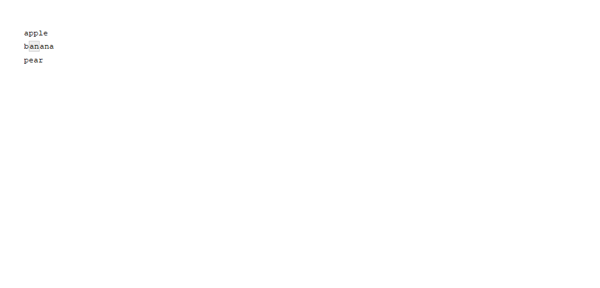

To match a literal `\` need `\\\\` because both string and regex will escape it.

``` r
x <- "a\\b"
writeLines(x)
```

    ## a\b

``` r
str_view(x,"\\\\")
```

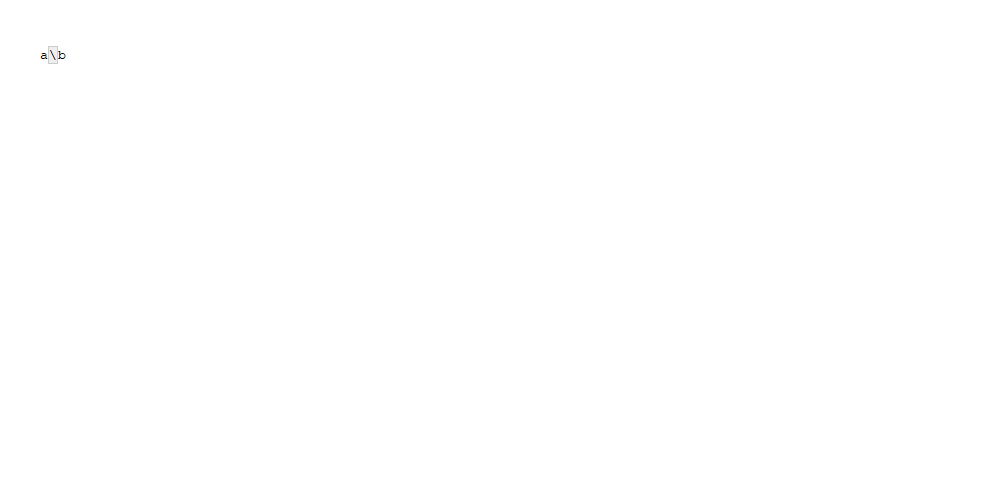

### 14.3.1.1

1.  *Explain why each of these strings don't match a `\`: `"\"`, `"\\"`, `"\\\"`.*

    `"\"` -&gt; leaves open quote string because escapes quote `"\\"`, -&gt; escapes second `\` so left with blank `"\\\"` -&gt; third `\` escapes quote so left with open quote as well

2.  *How would you match the sequence `"'\`?*

    ``` r
    x <- "alfred\"'\\goes"
    writeLines(x)
    ```

        ## alfred"'\goes

    ``` r
    str_view(x, "\\\"'\\\\")
    ```

    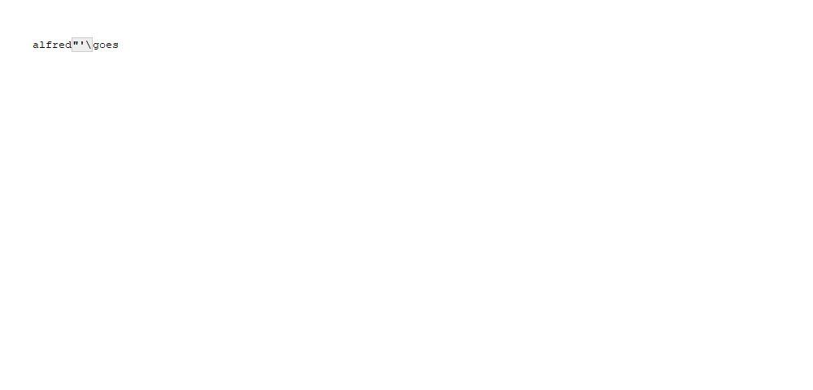

3.  *What patterns will the regular expression `\..\..\..` match? *

    Would match 6 character string of following form "(dot)(anychar)(dot)(anychar)(dot)(anychar)"

    ``` r
    x <- c("alf.r.e.dd.ss..lsdf.d.kj")
    str_view(x, pattern = "\\..\\..\\..")
    ```

    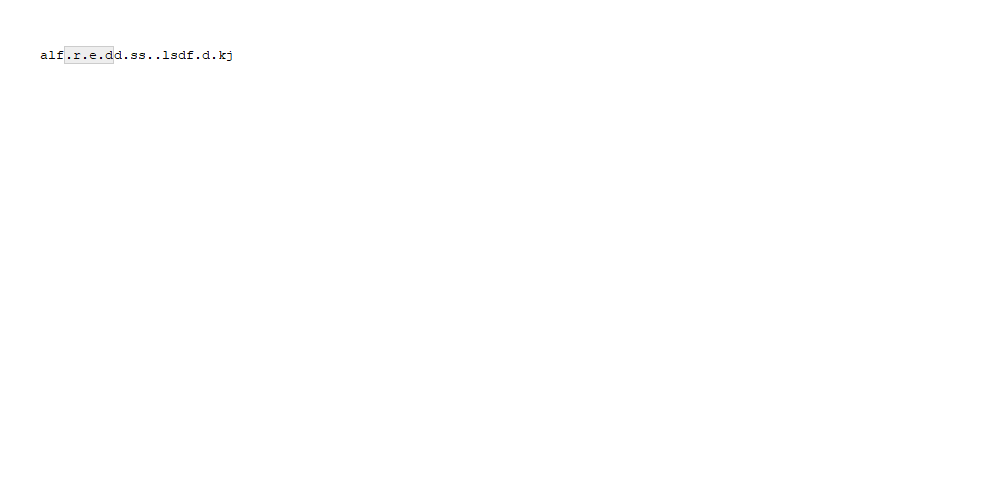

    *How would you represent it as a string?*

    ``` r
    x_pattern <- "\\..\\..\\.."
    writeLines(x_pattern)
    ```

        ## \..\..\..

### 14.3.2.1

Using `\b` to set boundary between words (not used often)

``` r
apropos("\\bsum\\b")
```

    ## [1] "contr.sum" "sum"

``` r
apropos("^(sum)$")
```

    ## [1] "sum"

1.  *How would you match the literal string `"$^$"`?*

    ``` r
    x <- "so it goes $^$ here"
    str_view(x, "\\$\\^\\$")
    ```

    

2.  *Given the corpus of common words in `stringr::words`, create regular* *expressions that find all words that:*

    1.  *Start with "y".*

    ``` r
    str_view(stringr::words, "^y", match = TRUE)
    ```

    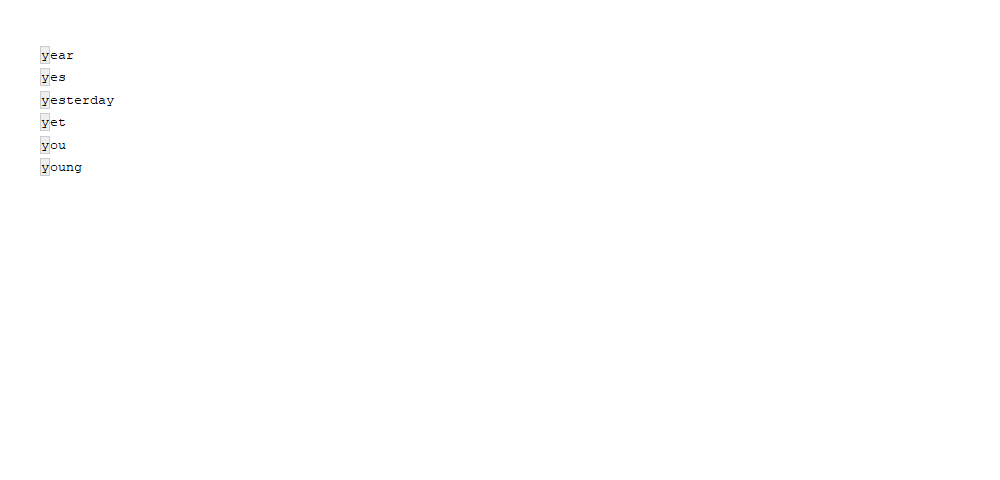

    1.  *End with "x"*

    ``` r
    str_view(stringr::words, "x$", match = TRUE)
    ```

    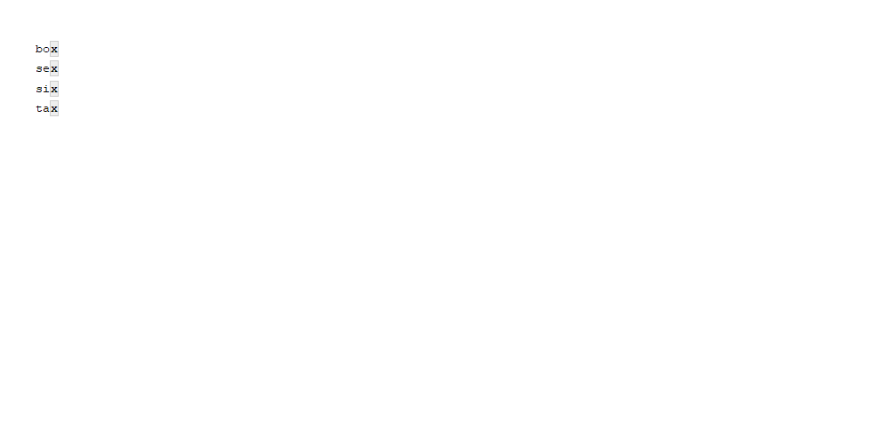

    1.  *Are exactly three letters long. (Don't cheat by using `str_length()`!)*

    ``` r
    str_view(stringr::words, "^...$", match = TRUE)
    ```

    1.  *Have seven letters or more.*

    ``` r
    str_view(stringr::words, ".......", match = TRUE)
    ```

    Since this list is long, you might want to use the `match` argument to `str_view()` to show only the matching or non-matching words.

### 14.3.3.1

Other special characters
\* `\d`: matches any digit. \* `\s`: matches any whitespace (e.g. space, tab, newline). \* `[abc]`: matches a, b, or c. \* `[^abc]`: matches anything except a, b, or c.

1.  *Create regular expressions to find all words that:*

    1.  *Start with a vowel.*

    ``` r
    str_view(stringr::words, "^[aeiou]", match = TRUE)
    ```

    1.  *That only contain consonants. (Hint: thinking about matching * *"not"-vowels.)*

    ``` r
    str_view(stringr::words, "^[^aeiou]*[^aeiouy]$", match = TRUE)
    ```

    

    1.  *End with `ed`, but not with `eed`.*

    ``` r
    str_view(stringr::words, "[^e]ed$", match = TRUE)
    ```

    

    1.  *End with `ing` or `ise`.*

    ``` r
    str_view(stringr::words, "(ing|ise)$", match = TRUE)
    ```

    

2.  *Empirically verify the rule "i before e except after c".*

    ``` r
    str_view(stringr::words, "(^(ei))|cie|[^c]ei", match = TRUE)
    ```

    

3.  *Is "q" always followed by a "u"?*

    ``` r
    str_view(stringr::words, "q[^u]", match = TRUE)
    ```

    

    of the words in list, yes.

4.  *Write a regular expression that matches a word if it's probably written* *in British English, not American English.*

    ``` r
    str_view(stringr::words, "(l|b)our|parat", match = TRUE)
    ```

    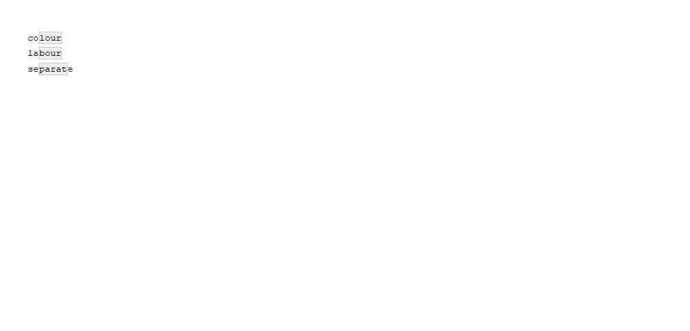

5.  *Create a regular expression that will match telephone numbers as commonly* *written in your country.*

    ``` r
    x <- c("dkl kls. klk. _", "(425) 591-6020", "her number is (581) 434-3242", "442", "  dsi")
    str_view(x, "\\(\\d\\d\\d\\)\\s\\d\\d\\d-\\d\\d\\d\\d")
    ```

    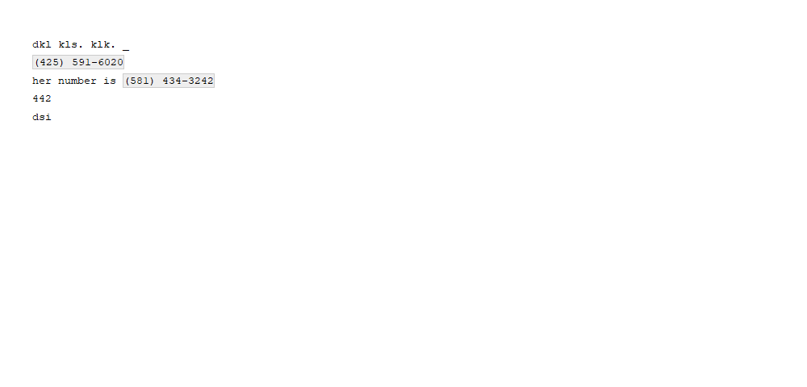

    Aboves not a good way to solve this, will see better methods in next section.

### 14.3.4.1

Controlling number of times:

-   `?`: 0 or 1
-   `+`: 1 or more
-   `*`: 0 or more
-   `{n}`: exactly n
-   `{n,}`: n or more
-   `{,m}`: at most m
-   `{n,m}`: between n and m

By default these matches are "greedy": they will match the longest string possible. You can make them "lazy", matching the shortest string possible by putting a `?` after them. This is an advanced feature of regular expressions, but it's useful to know that it exists:

``` r
x <- "1888 is the longest year in Roman numerals: MDCCCLXXXVIII"
str_view(x, 'C{2,3}')
```


``` r
str_view(x, 'C{2,3}?')
```

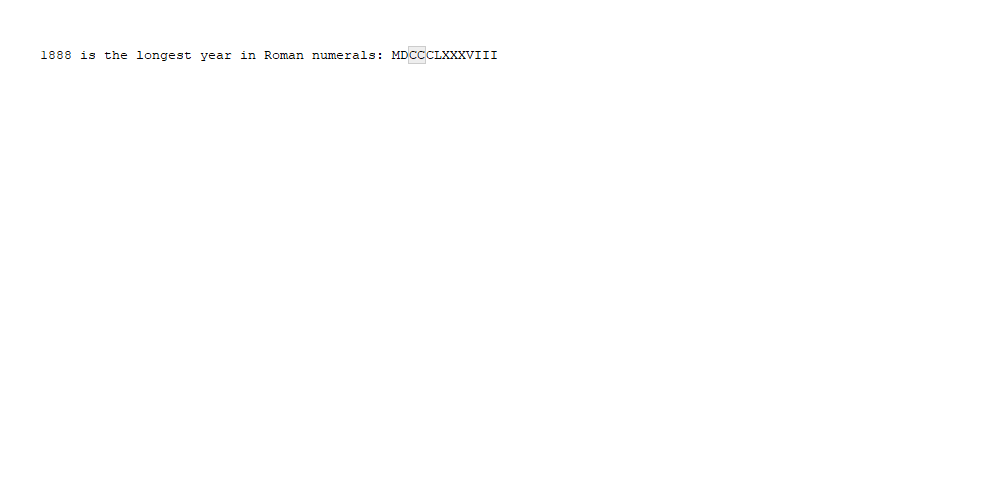

1.  *Describe the equivalents of `?`, `+`, `*` in `{m,n}` form.* `?` : `{0,1}` `+` : `{1, }` `*` : `{0, }`

2.  *Describe in words what these regular expressions match:* *(read carefully to see if I'm using a regular expression or a string* *that defines a regular expression.)*

    1.  `^.*$` : starts with anything, and ends with anything--matches whole thing

    ``` r
    str_view(x, "^.*$")
    ```

    

    1.  `"\\{.+\\}"` : match text in brackets greater than nothing

    ``` r
    x <- c("test", "some in {brackets}", "just {} no match")
    str_view(x, "\\{.+\\}")
    ```

    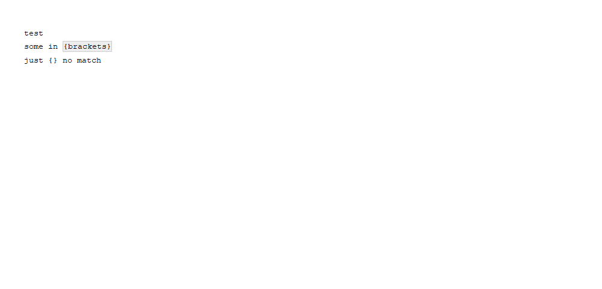

    1.  `\d{4}-\d{2}-\d{2}` : 4 numbers - 2 numbers - 2 numbers

    ``` r
    x <- c("4444-22-22", "test", "333-4444-22")
    str_view(x, "\\d{4}-\\d{2}-\\d{2}")
    ```

    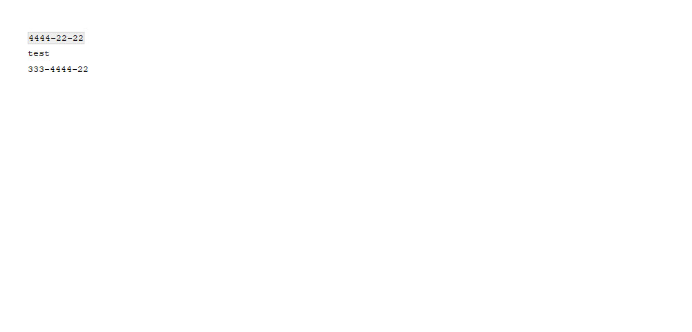

    1.  `"\\\\{4}"` : 4 brackets

    ``` r
    x <- c("\\\\\\\\", "\\\\\\", "\\\\", "\\")
    writeLines(x)
    ```

        ## \\\\
        ## \\\
        ## \\
        ## \

    ``` r
    str_view(x, "\\\\{4}")
    ```

        ## Warning in sample.int(x, size, replace, prob): '.Random.seed' is not an
        ## integer vector but of type 'NULL', so ignored

    

    ``` r
    x <- c("\\\\\\\\", "\\\\\\", "\\\\", "\\")
    str_view(x, "\\\\\\\\")
    ```

    

3.  *Create regular expressions to find all words that:*

    1.  find all words that start with three consonants

    ``` r
    str_view(stringr::words, "^[^aeoiouy]{3}", match = TRUE)
    ```

    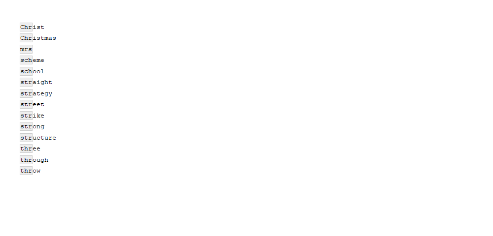

    Include `y` because when it shows up otherwise, is in vowel form.

    1.  have three or more vowels in a row

    ``` r
    str_view(stringr::words, "[aeiou]{3}", match = TRUE)
    ```

    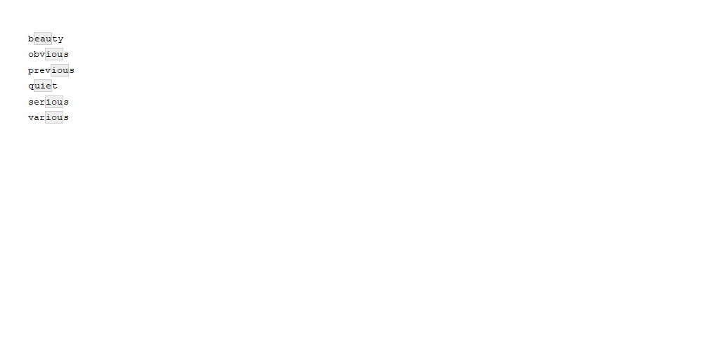

    In this case, do not include the `y`.

    1.  have 2 or more vowel-consonant pairs in a row

    ``` r
    str_view(stringr::words, "([aeiou][^aeiou]){2,}", match = TRUE)
    ```

4.  *Solve the beginner regexp crosswords at* *<https://regexcrossword.com/challenges/beginner>.*

### 14.3.5.1

1.  *Describe, in words, what these expressions will match:*

    \*I change questions 1 and 3 to what I think they were meant to be written as `(.)\\1\\1` and `(.)\\1` respectively.

    1.  `(.)\\1\\1` : repeat the char in the first group, and then repeat that char again
    2.  `"(.)(.)\\2\\1"` : 1st char, 2nd char followed by 2nd char, first char
    3.  `(..)\\1` : 2 chars repeated twice
    4.  `"(.).\\1.\\1"` : chars shows-up 3 times with one character between each
    5.  `"(.)(.)(.).*\\3\\2\\1"` : 3 chars in one order with \* chars between, then 3 chars with 3 letters in the reverse order of what it started

    ``` r
    x <- c("steefddff", "ssdfsdfffsdasdlkd", "DLKKJIOWdkl", "klnlsd", "t11", "(.)\1\1")

    str_view_all(x, "(.)\\1\\1", match = TRUE) #xxx
    ```

    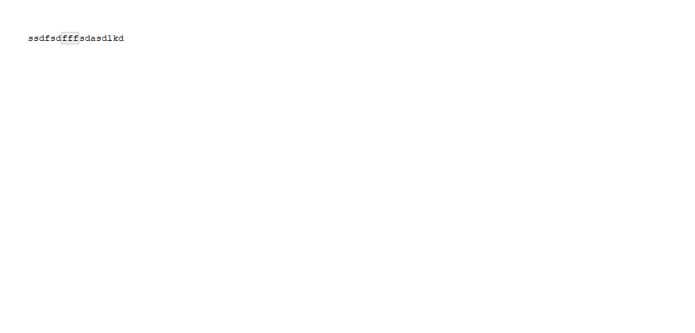

    ``` r
    str_view_all(fruit, "(.)(.)\\2\\1", match = TRUE) #xyyx
    ```

    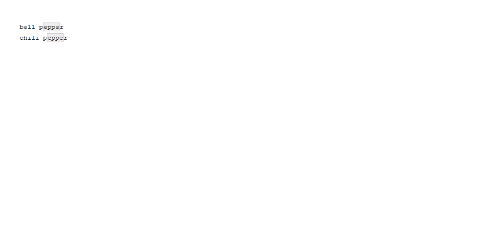

    ``` r
    str_view_all(fruit, "(..)\\1", match = TRUE) #xxyy
    ```

    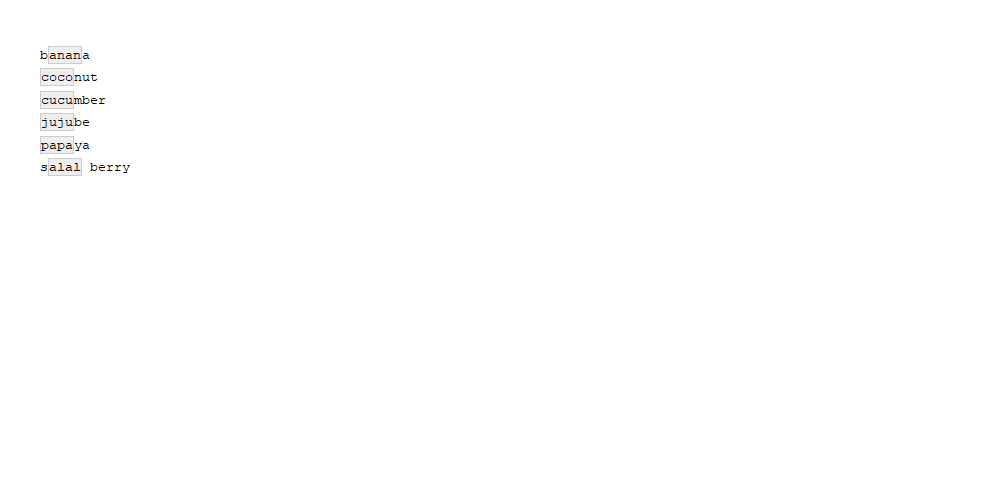

    ``` r
    str_view(stringr::words, "(.).\\1.\\1", match = TRUE) #x.x.x
    ```

    

    ``` r
    str_view(stringr::words, "(.)(.)(.).*\\3\\2\\1", match = TRUE) #xyz.*zyx
    ```

    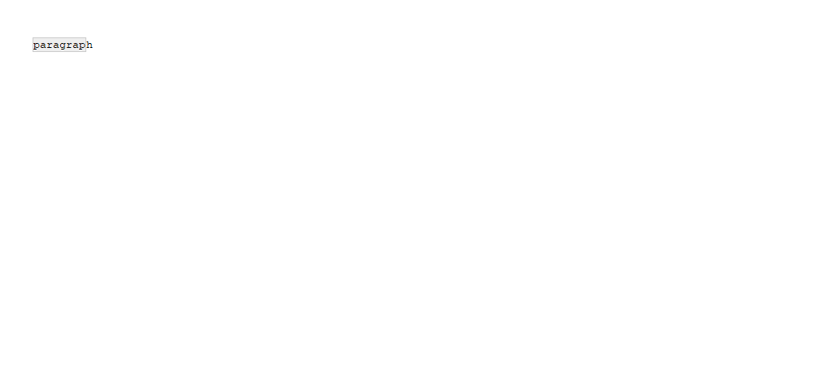

2.  *Construct regular expressions to match words that:*

    1.  *Start and end with the same character.*

    ``` r
    str_view(stringr::words, "^(.).*\\1$", match = TRUE)
    ```

    1.  *Contain a repeated pair of letters* (e.g. "church" contains "ch" repeated twice.)

    ``` r
    str_view(stringr::words, "(..).*\\1", match = TRUE)
    ```

    1.  *Contain one letter repeated in at least three places* (e.g. "eleven" contains three "e"s.)

    ``` r
    str_view(stringr::words, "(.).+\\1.+\\1", match = TRUE)
    ```

14.4 Tools
----------

Switch point with Stephen. Will take 30 minutes to go through the main points from exercises / solutions up to here.

### 14.4.2

1.  *For each of the following challenges, try solving it by using both a single* *regular expression, and a combination of multiple `str_detect()` calls.*

    1.  *Find all words that start or end with `x`.*

    ``` r
    str_subset(words, "^x|x$")
    ```

        ## [1] "box" "sex" "six" "tax"

    1.  *Find all words that start with a vowel and end with a consonant.*

    ``` r
    str_subset(words, "^[aeiou].*[^aeiouy]$")
    ```

        ##   [1] "about"       "accept"      "account"     "across"      "act"        
        ##   [6] "actual"      "add"         "address"     "admit"       "affect"     
        ##  [11] "afford"      "after"       "afternoon"   "again"       "against"    
        ##  [16] "agent"       "air"         "all"         "allow"       "almost"     
        ##  [21] "along"       "alright"     "although"    "always"      "amount"     
        ##  [26] "and"         "another"     "answer"      "apart"       "apparent"   
        ##  [31] "appear"      "appoint"     "approach"    "arm"         "around"     
        ##  [36] "art"         "as"          "ask"         "at"          "attend"     
        ##  [41] "awful"       "each"        "east"        "eat"         "effect"     
        ##  [46] "egg"         "eight"       "either"      "elect"       "electric"   
        ##  [51] "eleven"      "end"         "english"     "enough"      "enter"      
        ##  [56] "environment" "equal"       "especial"    "even"        "evening"    
        ##  [61] "ever"        "exact"       "except"      "exist"       "expect"     
        ##  [66] "explain"     "express"     "if"          "important"   "in"         
        ##  [71] "indeed"      "individual"  "inform"      "instead"     "interest"   
        ##  [76] "invest"      "it"          "item"        "obvious"     "occasion"   
        ##  [81] "odd"         "of"          "off"         "offer"       "often"      
        ##  [86] "old"         "on"          "open"        "or"          "order"      
        ##  [91] "original"    "other"       "ought"       "out"         "over"       
        ##  [96] "own"         "under"       "understand"  "union"       "unit"       
        ## [101] "unless"      "until"       "up"          "upon"        "usual"

    Counted `y` as a vowel if ending with, but not to start. This does not work perfect. For example words like `ygritte` would still be included even though `y` is activng as a vowel there whereas words like `boy` would be excluded even though acting as a consonant there. From here on out I am going to always exclude `y`.

    1.  *Are there any words that contain at least one of each different* *vowel?*

    ``` r
    vowels <- c("a","e","i","o","u")
    words[str_detect(words, "a") &
            str_detect(words, "e") &
            str_detect(words, "i") &
            str_detect(words, "o") & 
            str_detect(words, "u")]
    ```

        ## character(0)

    No. More elgant way of doing this using iteration methods we'll learn later is below.

    ``` r
    vowels <- c("a","e","i","o","u")

    tibble(vowels = vowels, words = list(words)) %>% 
      mutate(detect_vowels = purrr::map2(words, vowels, str_detect)) %>% 
      spread(key = vowels, value = detect_vowels) %>% 
      unnest() %>% 
      mutate(unique_vowels = rowSums(.[2:6])) %>% 
      arrange(desc(unique_vowels))
    ```

        ## Warning in mutate_impl(.data, dots): '.Random.seed' is not an integer
        ## vector but of type 'NULL', so ignored

        ## # A tibble: 980 x 7
        ##          words     a     e     i     o     u unique_vowels
        ##          <chr> <lgl> <lgl> <lgl> <lgl> <lgl>         <dbl>
        ##  1    absolute  TRUE  TRUE FALSE  TRUE  TRUE             4
        ##  2 appropriate  TRUE  TRUE  TRUE  TRUE FALSE             4
        ##  3   associate  TRUE  TRUE  TRUE  TRUE FALSE             4
        ##  4   authority  TRUE FALSE  TRUE  TRUE  TRUE             4
        ##  5   colleague  TRUE  TRUE FALSE  TRUE  TRUE             4
        ##  6    continue FALSE  TRUE  TRUE  TRUE  TRUE             4
        ##  7   encourage  TRUE  TRUE FALSE  TRUE  TRUE             4
        ##  8   introduce FALSE  TRUE  TRUE  TRUE  TRUE             4
        ##  9    organize  TRUE  TRUE  TRUE  TRUE FALSE             4
        ## 10    previous FALSE  TRUE  TRUE  TRUE  TRUE             4
        ## # ... with 970 more rows

    ``` r
    #seems that nothing gets over 4
    ```

2.  *What word has the highest number of vowels? What word has the highest* *proportion of vowels? (Hint: what is the denominator?)*

    ``` r
    vowel_counts <- tibble(words = words, 
                           n_string = str_length(words),
                           n_vowel = str_count(words, vowels),
                           prop_vowel = n_vowel / n_string)
    ```

    'Experience' has the most vowels

    ``` r
    vowel_counts %>% 
      arrange(desc(n_vowel))
    ```

        ## # A tibble: 980 x 4
        ##         words n_string n_vowel prop_vowel
        ##         <chr>    <int>   <int>      <dbl>
        ##  1 experience       10       4  0.4000000
        ##  2 individual       10       3  0.3000000
        ##  3    achieve        7       2  0.2857143
        ##  4     actual        6       2  0.3333333
        ##  5  afternoon        9       2  0.2222222
        ##  6    against        7       2  0.2857143
        ##  7    already        7       2  0.2857143
        ##  8    america        7       2  0.2857143
        ##  9    benefit        7       2  0.2857143
        ## 10     choose        6       2  0.3333333
        ## # ... with 970 more rows

    'a' has the highest proportion

    ``` r
    vowel_counts %>% 
      arrange(desc(prop_vowel))
    ```

        ## # A tibble: 980 x 4
        ##    words n_string n_vowel prop_vowel
        ##    <chr>    <int>   <int>      <dbl>
        ##  1     a        1       1  1.0000000
        ##  2   too        3       2  0.6666667
        ##  3   wee        3       2  0.6666667
        ##  4  feed        4       2  0.5000000
        ##  5    in        2       1  0.5000000
        ##  6  look        4       2  0.5000000
        ##  7  need        4       2  0.5000000
        ##  8  room        4       2  0.5000000
        ##  9    so        2       1  0.5000000
        ## 10  soon        4       2  0.5000000
        ## # ... with 970 more rows

### 14.4.3.1

1.  *In the previous example, you might have noticed that the regular* *expression matched "flickered", which is not a colour. Modify the * *regex to fix the problem.*

2.  *From the Harvard sentences data, extract:*

    1.  *The first word from each sentence.*

    ``` r
    str_extract(sentences, "[A-z]*")
    ```

    1.  *All words ending in `ing`.*

    ``` r
    #ends in "ing" or "ing."
    sent_ing <- str_subset(sentences, ".*ing(\\.|\\s)")  
    str_extract_all(sent_ing, "[A-z]+ing", simplify=TRUE)
    ```

    1.  *All plurals.*

    ``` r
    str_subset(sentences, "[A-z]*s(\\.|\\s)") %>% #take all sentences that have a word ending in s
      str_extract_all("[A-z]*s\\b", simplify = TRUE) %>%
      .[str_length(.) > 3] %>%  #get rid of the short words
      str_subset(".*[^s]s$") %>%   #get rid of words ending in 'ss'
      str_subset(".*[^i]s$")  #get rid of 'this'
    ```

### 14.4.4.1

``` r
noun <- "(a|the) ([^ \\.]+)"

has_noun <- sentences %>%
  str_subset(noun) %>%
  head(10) 

has_noun %>% 
  str_extract_all(noun, simplify = TRUE)

#creates split into seperate pieces
has_noun %>% 
  str_match_all(noun)

#Can make dataframe with, but need to name all
tibble(has_noun = has_noun) %>% 
  extract(has_noun, into = c("article", "noun"), regex = noun)
```

1.  *Find all words that come after a "number" like "one", "two", "three" etc.* *Pull out both the number and the word.*

    ``` r
    #Create regex expression
    nums <- c("one", "two", "three", "four", "five", "six", "seven", "eight", "nine")
    nums <- str_c("\\b", nums)
    nums_c <- str_c(nums, collapse = "|")
    re <- str_c("(",nums_c,")", " ", "([^ \\.]+)", sep = "")
    re

    sentences_with_nums <- sentences %>% 
      str_subset(regex(re, ignore_case = TRUE))

    #SAME THING, but in a DF
    tibble(sentences_var = sentences_with_nums) %>% 
      extract(sentences_var, into = c("num", "following"), regex = re, remove = FALSE)
    ```

2.  *Find all contractions. Separate out the pieces before and after the * *apostrophe.*

    ``` r
    contr <- "([^ \\.]+)'([^ \\.]*)"  #note the () facilitate the split with functions
    sentences %>% 
      str_subset(contr) %>% #note the improvement this word definition is to the above [^ ]+ 
      str_match_all(contr)
    ```

### 14.4.5.1

1.  *Replace all forward slashes in a string with backslashes.*

    ``` r
    x <- c("test/dklsk/")
    str_replace_all(x, "/", "\\\\") %>% 
      writeLines()
    ```

        ## test\dklsk\

2.  *Implement a simple version of `str_to_lower()` using `replace_all()`.*

    ``` r
    x <- c("BIdklsKOS")
    str_replace_all(x, "([A-Z])", tolower)
    ```

        ## [1] "bidklskos"

3.  *Switch the first and last letters in `words`. Which of those strings* *are still words?*

    ``` r
    str_replace(words, "(^.)(.*)(.$)", "\\3\\2\\1")
    ```

    Any words that start and end with the same letter, e.g. 'treat', as well as a few other examples like, war --&gt; raw .

### 14.4.6.1

When using `boundary()` with `str_split` can set to "character", "line", "sentence", and "word" and gives alternative to splitting by pattern.

1.  *Split up a string like `"apples, pears, and bananas"` into individual* *components.*

    ``` r
    x <- "apples, pears, and bananas"
    str_split(x, ",* ")  #note that regular expression works to handle commas as well
    ```

        ## [[1]]
        ## [1] "apples"  "pears"   "and"     "bananas"

2.  *Why is it better to split up by `boundary("word")` than `" "`?*

    Handles commas and punctuation, I though still would prefer to use patterns where possible over `boundary` function. regex is more generally applicabale as well outside of R.

    ``` r
    str_split(x, boundary("word"))
    ```

        ## [[1]]
        ## [1] "apples"  "pears"   "and"     "bananas"

3.  *What does splitting with an empty string (`""`) do? Experiment, and* *then read the documentation.* Splitting by an empty string splits up each character.

    ``` r
    str_split(x,"")
    ```

        ## [[1]]
        ##  [1] "a" "p" "p" "l" "e" "s" "," " " "p" "e" "a" "r" "s" "," " " "a" "n"
        ## [18] "d" " " "b" "a" "n" "a" "n" "a" "s"

14.5: Other types of patterns
-----------------------------

`regex` args to know:

-   `ignore_case = TRUE` allows characters to match either their uppercase or lowercase forms. This always uses the current locale.
-   `multiline = TRUE` allows `^` and `$` to match the start and end of each line rather than the start and end of the complete string.
-   `comments = TRUE` allows you to use comments and white space to make complex regular expressions more understandable. Spaces are ignored, as is everything after `#`. To match a literal space, you'll need to escape it: `"\\ "`.
-   `dotall = TRUE` allows `.` to match everything, including `\n`.

Alternatives to `regex()`: \* `fixed()`: matches exactly the specified sequence of bytes. It ignores all special regular expressions and operates at a very low level. This allows you to avoid complex escaping and can be much faster than regular expressions. \* `coll()`: compare strings using standard **coll**ation rules. This is useful for doing case insensitive matching. Note that `coll()` takes a `locale` parameter that controls which rules are used for comparing characters.

### 14.5.1

1.  *How would you find all strings containing `\` with `regex()` vs.* *with `fixed()`?* would be `\\` instead of `\\\\`

    ``` r
    str_view_all("so \\ the party is on\\ right?", fixed("\\"))
    ```

    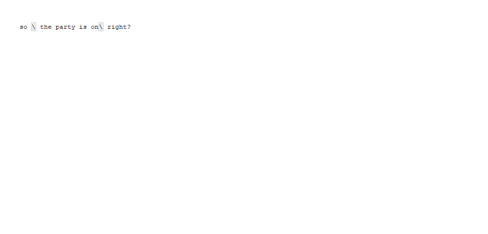

2.  *What are the five most common words in `sentences`?*

    ``` r
    str_extract_all(sentences, boundary("word"), simplify = TRUE) %>%
      as_tibble() %>%
      gather(V1:V12, value = "words", key = "order") %>%
      mutate(words = str_to_lower(words)) %>%
      filter(!words == "") %>%
      count(words, sort = TRUE) %>%
      head(5)
    ```

        ## # A tibble: 5 x 2
        ##   words     n
        ##   <chr> <int>
        ## 1   the   751
        ## 2     a   202
        ## 3    of   132
        ## 4    to   123
        ## 5   and   118

### 14.7.1

Other functions: `apropos` searches all objects available from the global environment--useful if you can't remember fun name. E.g. below checks those that start with `replace` and then those that start with `str`, but not `stri`

``` r
apropos("^(replace)")
```

    ## [1] "replace"    "replace_na"

``` r
apropos("^(str)[^i]")
```

    ##  [1] "str_c"           "str_conv"        "str_count"      
    ##  [4] "str_detect"      "str_dup"         "str_extract"    
    ##  [7] "str_extract_all" "str_interp"      "str_join"       
    ## [10] "str_length"      "str_locate"      "str_locate_all" 
    ## [13] "str_match"       "str_match_all"   "str_order"      
    ## [16] "str_pad"         "str_replace"     "str_replace_all"
    ## [19] "str_replace_na"  "str_sort"        "str_split"      
    ## [22] "str_split_fixed" "str_sub"         "str_sub<-"      
    ## [25] "str_subset"      "str_to_lower"    "str_to_title"   
    ## [28] "str_to_upper"    "str_trim"        "str_trunc"      
    ## [31] "str_view"        "str_view_all"    "str_which"      
    ## [34] "str_wrap"        "strcapture"      "strftime"       
    ## [37] "strheight"       "strOptions"      "strptime"       
    ## [40] "strrep"          "strsplit"        "strtoi"         
    ## [43] "strtrim"         "StructTS"        "structure"      
    ## [46] "strwidth"        "strwrap"

1.  *Find the stringi functions that:*
    1.  *Count the number of words.* -- `stri_count`
    2.  *Find duplicated strings.* -- `stri_duplicated`
    3.  *Generate random text.* -- `str_rand_strings`
2.  *How do you control the language that `stri_sort()` uses for * *sorting?*

    `decreasing =`
